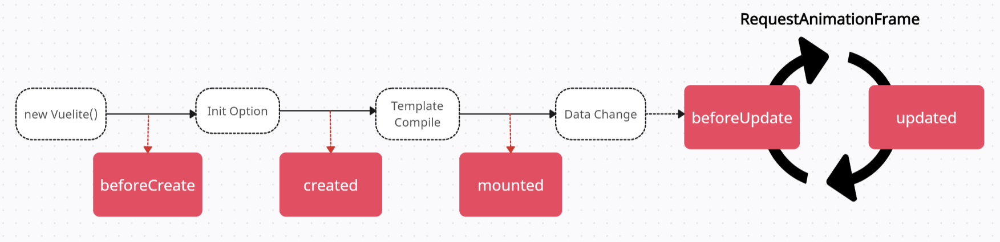

<p align='center'>
  
</p>

<p align='center'>Clones Vue.js to implement a basic MVVM framework</p>

<p align='center'>
    <a href='https://vuelite-demo.vercel.app'>
        
    </a>
    <a href=''>
        
    </a>
    <a href='https://www.npmjs.com/package/vue-lite-js'>
        
    </a>
</p>

<p align='center'>
   <a href='./README.md'>한국어</a> | <strong>English ✅</strong>
</p>

<details>
  <summary style="font-size: 1.3em;">
    <strong>🔖 Table of Contents</strong>
  </summary>

+ **[Introduction](#-introduction)**
+ **[Changelog](#-changelog)**
+ **[Getting Started](#-getting-started)**
+ **[Basic usage](#basic-usage)**
+ **[Details](#-details)**
+ **[Overview](#-overview)**
+ **[Workflow](#-workflow)**
  + [Create ViewModel](#1-create-viewmodel)
  + [Inject Reactivity](#2-inject-reactivity)
  + [Directive and Template Parsing](#3-directive-and-template-parsing)
  + [v-model Binding](#4-v-model-binding)
  + [Create Observer](#5-create-observer)
+ **[Extended Features](#️-extended-features)**
  + [Expression Support](#1-expression-support-130)
  + [Conditional Rendering](#2-conditional-rendering-143)
  + [List Rendering](#3-list-rendering-155)
  + [Handle Data Changes](#4-responding-to-data-changes-156)
  + [Add Lifecycle Hooks](#5-adding-lifecycle-hooks-160)
  + [Add Watch](#6-adding-watch-170)
  + [Modify methods Option Behavior](#7-changes-to-the-methods-option-behavior-171)
  + [Add Ref and Instance Properties](#8-addition-of-ref-and-instance-properties-172)
  + [Component-based Development and Props Support](#9-component-based-development-and-props-support-200)
  + [Partial Composition API Style Support](#2-conditional-rendering-143)
+ **[Rendering Strategy and Issues](#️-rendering-strategy-and-issues-160)**
+ **[Reference](#-reference)**

</details>


## 🌐 Translation Notice

This document has been translated using an **automated translation tool** and has been reviewed for accuracy. However, as a non-native English speaker, there may be limitations in the translation. The nuances and content I intended to convey might differ slightly from the original document. For the most accurate information, please refer to the [original document](./README.md). Please be aware that there might be issues or misunderstandings due to translation.


## 🚀 Introduction

Inspired by modern frameworks that support efficient data binding and user interface management based on the `MVVM (Model-View-ViewModel)` pattern, this is a basic `MVVM` framework that clones the declarative rendering model of `Vue.js`. It abstracts complex `DOM` manipulation, allowing developers to handle `UI` in a simpler and more intuitive manner. By automatically synchronizing data and `UI` state, it enables the efficient composition of user interfaces. Additionally, with template syntax and various directives, declarative `UI` development becomes easy, and `UI` that instantly reflects data changes can be quickly implemented.

The primary goal is to clone the core functionality of `Vue.js` and support its syntax while applying the `MVVM` pattern and the essential observer pattern. By using the `Proxy` object to detect data changes, this reactive system notifies directives that depend on the data `(Observer)`, triggering updates to the view. The overall structure of the project is built upon the code provided in the [Reference](#-reference) section, and while it lacks optimization and doesn’t account for complex issues, it serves as a helpful tool for understanding the core principles of `Vue.js`, including two-way data binding.

## 🌟 Changelog
- ***Improved type inference and autocomplete for `this` in methods and computed properties*** `<1.1.0>`
- ***Support for directive shorthand syntax*** `<1.2.1>`
- ***Expression support in directives and templates*** `<1.3.0>`
- ***Added conditional rendering (v-if/else, v-show directives)*** `<1.4.3>`
- ***Added list rendering (v-for directive)*** `<1.5.5>`
- ***Handle data changes*** `<1.5.6>`
- ***Added Lifecycle Hooks*** `<1.6.0>`
- ***Added watch functionality*** `<1.7.0>`
- ***Added Ref and instance properties*** `<1.7.2>`
- ***Component-based development and props support*** `<2.0.0>`
- ***Partial support for Composition API style*** `<2.1.3>`


## 🎉 Getting Started

- #### Using npm
To install `vuelite` from `npm` and use it in your project, run the following command:

```sh
npm install vue-lite-js@latest
```

- #### Using cdn
To use `vuelite` directly in the browser, include the script via a `cdn` as shown below:
```html
<script src="https://unpkg.com/vue-lite-js@latest"></script>
```

- #### Local Development
If you want to modify the source code and test it directly in a development environment, follow these steps:

##### Clone the repository
```sh
git clone https://github.com/Heonys/vue-lite-js 
```
##### Install dependencies
```sh
npm install 
```
##### Start the development server
```sh
npm run start 
```

##### Write markdown and scripts for testing
```sh
📦 vuelite 
├── 📂 dev 
│    ├── 📄 index.html ✅
│    └── 📄 index.ts ✅
├── 📂 src ✅
│    ├── 📂 core
│    ├── 📂 types
│    ... 
```
You can modify the source code in the `src` folder and write markdown and scripts in the `dev` folder.


## 💡Basic usage

<p align="center">
  
  <br />
  <span>CDN Demo: </span>
  <a href='https://vuelite-demo.vercel.app' target="_blank">https://vuelite-demo.vercel.app</a>
</p>

```html
<div id="app">
  <input type="text" v-model="message" />
  <p v-style="textStyle">{{ message }}</p>
  <button v-on:click="handleClick">change vuelite</button>
  <div>
    <input type="checkbox" v-model="checked" />
    <span>{{ isChecked }}</span>
  </div>
</div>
```
```ts
import Vuelite from "vue-lite-js";

new Vuelite({
  el: "#app",
  data() {
    return {
      message : "",
      checked: true,
      textStyle: { color: "#FF0000" },
    }
  },
  methods: {
    handleClick() {
      this.message  = "vuelite";
    },
  },
  computed: {
    isChecked() {
      return this.checked ? "checked" : "unchecked";
    },
  }
})
```

## ✨ Details

- This framework clones the **Options API** style of `Vue.js`, supporting core features, but not all functionalities are available.
- The `template` property in the options is supported, but since loaders like `.vue` extension in `Vue.js` are not supported, markup must be written separately in an `HTML` file. Therefore, separating templates in this way resembles `Angular` more than traditional `Vue.js`.
- Since single-file component format is not supported, the options include `styles` and `scopedStyles` properties.
- To track changes in data, maintaining reference values is enforced. Instead of assigning new references, modify the properties of the existing object to maintain the connection with the proxy and accurately track changes.
- The `v-if` directive can only be used on a single element, and the `v-else-if` directive is not supported.
- The `v-for` directive does not provide key bindings, and elements are always re-rendered based on the index when the data changes.
- Simultaneous usage of both `v-if` and `v-for` on the same element is not supported.
- The `Lifecycle` hooks are simplified, supporting 6 major hooks while excluding others like `unmounted`.
- Component-based development is supported by separating markup using the `<template>` tag within the `HTML` file.
- Data transmission between parent and child components is supported via `props`, but the `v-slot` directive is not supported.
- Partial support for the `Composition API` style is provided, but it does not replace all `Options API` features.

> **Note**: For simple usage examples covering various cases, refer to [FEATURES.md](./docs/FEATURES.md).


## 🧩 Overview

<p align="center">
  
</p>


## ⭐ Workflow

### 1. Creating a ViewModel
```ts
class Vuelite {
  constructor(options: Options) {
    this.el = document.querySelector(options.el);
    this.options = options;
    injectReactive(this);
    injectStyleSheet(this);
    const scanner = new VueScanner(new NodeVisitor());
    scanner.scan(this);
  }
}
```
In the `MVVM` pattern, creating a `viewmodel` involves initializing a `vue` instance with an `options` object to provide `DOM` and data binding. This serves as the entry point for setting up the view model.

> **Key Ideas for Implementing ViewModel**
>1. Inject reactivity into the data received through the options object to detect changes.
>2. Traverse the DOM to parse directives and create observers.
>3. Achieve two-way binding through interactions between reactive data and observers.


### 2. Injecting Reactivity

<p align="center">
  
</p>

```ts
// target: The original object to be wrapped
// handler: An object containing methods, called 'traps', that intercept operations
new Proxy(target, handler);
```

The [Proxy](https://developer.mozilla.org/ko/docs/Web/JavaScript/Reference/Global_Objects/Proxy) object is a wrapper around the original object that controls access to it and allows for interception of specific actions to add new functionalities.

Since our goal is to detect changes in the data and achieve two-way binding with the actual view (DOM), we need to consider how to detect changes in data. In JavaScript, this can be achieved using `Object.defineProperty`, which allows dynamic registration of `getter` and `setter` methods on object properties, along with `Proxy`.

> In `Vue2`, reactive data is implemented using `defineProperty`, while `Vue3` uses `Proxy` for this purpose.

Therefore, we will wrap all `data` properties of the `viewmodel` with a `Proxy`, adding `get traps` and `set traps` to detect changes in all properties.


```ts
const handler = {
  get(target: Target, key: string, receiver: Target) {
    // 1. get trap (getter)
  },
  set(target: Target, key: string, value: any, receiver: Target) {
    // 2. set trap (setter)
  },
};
new Proxy(data, handler);
```

However, at the current stage of creating the `Proxy`, explaining `getter` and `setter` might be somewhat challenging. It's important to note that these are traps that operate when accessing or modifying the properties. Although they are crucial for the core logic, at this stage, you can simply understand that `getter` and `setter` are registered to inject `Reactivity`.

1) **Get Trap**
The `get` trap is responsible for creating a [Dep](#dep-object-creation) object and linking it with the currently active [Observer](#5-observer-creation). During the parsing of directives in the `Scanner` and creation of the `Observer`, a `getter` is triggered when finding the `expression` corresponding to the directive in the `vm`. Consequently, a `Dep` associated with this `expression` is created, establishing a link with the newly created `Observer`.

2) **Set Trap**
Since the `get` trap has already been executed when the `Observer` is created, the `set` trap is always mapped to the corresponding `Dep` for the relevant `key`. The occurrence of a `setter` signifies a change in the property's value. The `set` trap then calls `notify` to send a notification to all `Observers` subscribed to the corresponding `Dep`, informing them that the property they are dependent on has changed and prompting them to `update`.


#### Dep Object Creation
The `Dep` object stands for `Dependency` and plays a role in detecting changes in data and notifying the subscribed `Observer`s. Although a `Dep` object is created for every data property when the `Proxy` is initialized, it indicates that every reactive data has its corresponding `Dep`. The `Dep` instance itself does not maintain the state of the mapped reactive data. This is because the `define` method of `Reactivity` internally maps `keys` to `Dep` objects using a structure named `deps`. When the `setter` is triggered, it accesses the `deps` in the closure to identify the mapped `key`. Therefore, the `Dep` itself does not hold the state of the key it is mapped to but can perform `notify` operations.


```ts
class Dep {
  static activated: Observer
  //...
}
```
The `activated` property is a `static` variable that holds the current active observer and is used to establish the dependency relationship between `Dep` and `Observer`. It acts like a global variable for tracking the active observer.


#### Injecting `computed` and `methods`
```ts
injectMethod(vm);
injectComputed(vm);
```

Unlike `data`, which requires reactivity for data binding to the `DOM`, `computed` properties and `methods` do not need to be reactive. Therefore, they can be registered as properties of the `viewmodel` so that they can be accessed accordingly. The key point is to explicitly bind `this` so that when `computed` or `method` functions use `this`, it correctly refers to the `viewmodel`.


### 3. Directive and Template Parsing
```ts
const scanner = new VueScanner(new NodeVisitor());
scanner.scan(this);
```

From the `el` property provided in the options, we traverse all child nodes to inspect for any `v-` prefixed directive attributes or template syntax `{{ }}` used in text nodes. The reason for traversing nodes at the `Node` level rather than the `DOM` level is to ensure that text nodes are examined for template parsing. <br />

To handle node traversal, the actual traversal role is delegated to a `Visitor`, while specific actions for each node are processed by the `Scanner`. This separation ensures that `Visitor` and `Scanner` handle distinct responsibilities.


```ts
const action = (node: Node) => {
  isReactiveNode(node) && new Observable(vm, node);
};
```
As we traverse all nodes, we check whether each node has directives or template syntax in its text and create `Observable` instances accordingly. <br />

Here, `Observable` simply checks whether the node is a directive with the `v-` prefix or a template, creating `Directive` objects as needed. Template bindings are converted to `v-text` directives. Except for `v-on`, which handles event registration, all other directives receive an `updater` as an argument. This is used to create `Observer` instances uniformly for directives like `v-bind`.


### 4. v-model Binding

The `v-model` directive in `Vue.js` simplifies the implementation of two-way data binding, allowing user inputs to automatically synchronize with the data in the `vue` instance. This directive is used for UI elements that receive user input, such as `input`, `textarea`, and `select` elements. <br /> 


```html
<!-- wo-way binding using v-model -->
<div>
  <input type="text" v-model="title">
  <div>{{ title }}</div>
</div>`;

<!-- One-way binding + Event Handler -->
<div>
  <input 
    type="text" 
    v-bind:value="title" 
    v-on:input="handleInput"
  >
  <div>{{ title }}</div>
</div>
```

In practice, `v-model` operates similarly to the combination of `v-bind` and `v-on:event` shown in the code above. `vuelite` supports both of these methods for two-way data binding.


```html
<input type="checkbox" v-model="isChecked">

<input type="radio" name="gender" value="male" v-model="selectedOption">
<input type="radio" name="gender" value="female" v-model="selectedOption">

<select v-model="selectedRadio">
  <option value="javascript">javascript</option>
  <option value="python">python</option>
</select>
```

When implementing `v-model`, the challenge is that each element has different binding values such as `value`, `checked`, etc., and even for the same `checked` property, `checkbox` and `radio` buttons operate differently. Additionally, events can vary, such as `change` and `input`, which necessitates a consistent approach to accessing and binding element values or states. <br />

Therefore, when handling `v-model` in the `Directive` class, it's important to manage these elements or types consistently by implementing branching logic to register the appropriate `updater` and event listeners.


### 5. Create Observer

```ts
bind(updater?: Updater) {
  // ... 
  const value = evaluateValue(this.vm, this.exp);
  updater && updater(this.node, value);
  new Observer(this.vm, this.exp, (value) => {
    updater && updater(this.node, value);
  });
```

The type of `updater` is determined based on the type of directive, which ultimately leads to the creation of an `Observer`. 

In this context, an `updater` refers to a specific update function that is triggered when a change occurs in a property with `Reactive` injected, and the `set trap` calls `notify`. This function notifies all `Observers` subscribed to the corresponding `dep` that a change has occurred and requests them to update. In other words, an `Observer` responds to changes by updating the `DOM`, ensuring that changes in the `viewmodel`'s `data` are eventually reflected on the screen. <br /> 

Before creating an `Observer`, the `updater` is executed once to reflect the `viewmodel`'s properties onto the `DOM` during the initial rendering.


#### Relationship between Observer and Dep

They have a many-to-many relationship, where each manages a collection of the other. <br />

From the perspective of `Dep`, it manages multiple `Observers` because several directives can use the same property. Conversely, an `Observer` can depend on multiple `Deps` because a single directive can rely on multiple reactive data sources.

> The data passed through options results in the creation of a `Dep` that maps 1:1 with each piece of data. Similarly, each directive creates an `Observer` that maps 1:1 with itself. Think of them as interacting with each other through this 1:1 mapping.


#### getterTrigger

```ts
// Observer
getterTrigger() {
  Dep.activated = this;
  const value = evaluateValue(this.vm, this.exp);
  Dep.activated = null;
  return value;
}
// Dep 
depend() {
    Dep.activated?.addDep(this);
}
```

The `Observer` class has a method called `getterTrigger`, which may seem to simply retrieve the property from `vm`, but it serves a more crucial role.

>1. Initially, it is used as a trigger to intentionally cause the `get trap` on the proxy objects wrapping all `data` properties in the `Reactivity` class.
>2. Before the `get trap` occurs, it sets `Dep.activated` to the current `this`, meaning the current `Observer`, and when the `get trap` happens, it calls `dep.depend()` to establish the relationship between the currently activated `Observer` and the `Dep`.

As a result, `getterTrigger` plays a key role by triggering the `get trap` of reactive data, creating `Dep` objects, and simultaneously establishing the relationship between these `Dep` objects and `Observer`.


## ⚙️ Extended Features

### 1. Expression Support `<1.3.0>`

When using directives or template syntax in `Vue.js`, there are times when you want to evaluate expressions directly rather than simply binding reactive data.

```html
<input v-bind:disabled="isDisabled ? true : false" />
<div :class="{ active: isActive }"></div>
<div v-if="count > 5"></div>
<button @click="visible = !visible"></button>

<p>{{ age + 5 }}</p> 
<p>{{ `Welcome, ${name}` }}</p> 
<p>{{ items[0] }}</p> 
```
While this could be replaced by defining methods in the `computed` option, creating new methods for simple logic can be cumbersome when there's no need for reusability. Using expressions directly provides a more straightforward solution. Thus, enabling direct expression binding offers more flexible template design.

#### unsafeEvaluate

In `Vue.js`, expressions are likely processed safely through a parsing and compilation process, but for a compromise between performance and security, the `Function` constructor is used to allow expression evaluation.

```ts
function unsafeEvaluate(context: object, expression: string) {
  try {
    const fn = new Function(`
      with (this) {
        return ${expression};
      }
    `);
    return fn.call(context);
  } catch (error) {
    return undefined;
  }
}
```

In `methods` or `computed` options, you typically reference reactive data using `this.title`, but to simplify expressions, the `with` statement is used inside the `new Function` to allow access to variables like `title` directly, without referencing `this`.

>The `with` statement is deprecated in `ES5` and later, and is not recommended due to potential performance degradation and security vulnerabilities. However, it was used here to mimic `Vue.js` behavior more closely.


### 2. Conditional Rendering `<1.4.3>`

<p align="center">
  
</p>

```html
<div>
  <input type="checkbox" v-model="visible" />
  <span>{{ visible ? "🔓" : "🔒" }}</span>

  <h1 v-if="visible">Vue is awesome!</h1>
  <h1 v-else>Oh no 😢</h1>
</div>
```
```ts
new Vuelite({
  el: "#app",
  data() {
    return {
      visible: true,
    }
  },
})
```

#### **Basic Operation of v-if** <br />

The `v-if` directive is used to dynamically render `DOM` elements based on a condition. The element is only rendered when the provided expression is `truthy`, and it is not included in the `DOM` when it is `falsy`. Additionally, you can optionally handle additional conditions using `v-else`, and there is `v-show` which performs similar conditional rendering to `v-if`.

```html
<div v-if="condition">hello vue</div>
```

#### Key Ideas  

1) **Difference between v-show and v-if** <br />

The `v-show` directive controls the visibility of an element by simply determining whether to apply `display: none` based on the value. In contrast, `v-if` removes the element from the `DOM` when the mapped data is `false` and reinserts it when it becomes `true`. This means that `v-show` is always rendered and can be treated like existing directives with simple style changes. However, `v-if` must conditionally delete or insert elements, which makes deletion straightforward, but it raises the question of how to remember the previous position for reinsertion.

2) **Basic Flow of v-if** <br />

>1. Remember the current child's index from the parent using the `children` property.
>2. When the condition is `false`, move the currently rendering `v-if` element to a `fragment` for temporary storage.
>3. When the condition becomes `true`, retrieve and insert the value from the `fragment` right before the remembered index.
>4. If the `v-else` directive exists, it pairs with `v-if` and behaves oppositely.

3) **Rendering Strategy of v-if** <br />

Since `v-if` directly affects the `DOM`, any structural changes to the `DOM` can impact other directives before they are fully parsed. Therefore, the handling of the `v-if` directive is delayed until all directives have been processed, and it is handled in a `lazy` manner. Additionally, instead of the existing relationship between `Directive` and `Observer`, a new instance called `Condition` is created for `v-if`. This is necessary because it needs to retain the `DOM` when the mapped value is `falsy` and pair with the `v-else` clause, requiring additional state that differentiates it from other directives.

#### **Limitations of v-if**

- `v-else-if` and `<template v-if>` are not supported, and `v-else` must immediately follow `v-if` to function correctly; otherwise, the `v-else` directive will be ignored.
- Nested `v-if` is allowed, and `v-for` can be used within `v-if/else`. However, according to the official `Vue.js` documentation, it is not recommended to use `v-if` and `v-for` together. For more details, refer to the [Style Guide](https://vuejs.org/style-guide/rules-essential#avoid-v-if-with-v-for).
- In actual `Vue.js`, when `v-if` and `v-for` are used together on a single element, `v-if` has a higher priority for rendering, but in `vuelite`, they cannot be used together.


### 3. List Rendering `<1.5.5>`

<p align="center">
  
</p>


#### **Basic Functionality of v-for** <br />

The `v-for` directive is used to iteratively generate `DOM` elements based on list data. It dynamically creates and renders `DOM` elements by traversing lists such as arrays, objects, and integer values. In this process, the `v-for` directive defines the template for the elements to be repeated, providing a structure that resembles the `<template>` tag in `HTML`, which is used to define repetition without actually rendering it. 

- The data for `v-for` can be traversed from arrays, objects, strings, and integer values.
- The alias value for `v-for` supports optional aliases such as indices using parentheses.
```html
<div v-for="(value, key, index) in myObject"></div>
<div v-for="(item, index) in myArray"></div>
<div v-for="(value, index) in 10"></div>
```

#### Key Ideas  

1) **Commonality with v-if** <br />

Essentially, `v-for` traverses through the size of the data at the current position, dynamically generating `DOM` elements. Consequently, like `v-if`, it inevitably alters the structure of the `DOM`, which can affect the processing of other directives during subsequent parsing. To resolve dependencies between directives, the processing of directives is deferred and handled collectively later on.

2) **Basic Workflow of v-for** <br />

>1. Analyze the expression passed to `v-for` to identify the data type of the list and the aliases used. For example, in the expression `(value, key, index) in myObject`, it can be determined that the list data is an object and that three aliases are being utilized.
>2. Based on the analyzed expression, create a `context` object. The `context` varies depending on the data type of the list and the number of aliases, providing information about each `alias` and the current index of iteration to calculate the values of the internal aliases later.
>3. Iterate over the size of the list, using the element defined by `v-for` as a template, and inject the `context` into the template to dynamically create new `DOM` elements during each iteration.
>4. The dynamically generated `DOM` may contain directives or template syntax. Therefore, similar to creating a `Vuelite` instance initially, the `scanner` re-parses the directives, ultimately repeating the process of creating the `Observer`.

3) **Role of Context** <br />

`v-for` operates by repeatedly injecting context into the template to dynamically create `DOM`, functioning like a smaller scoped `Vuelite` instance. Additionally, since it shares the same `vm`, the directives of the `DOM` created inside `v-for` maintain relationships with the existing reactive data.

To better understand how the `v-for` directive should be constructed, consider the transformation from the `Before` `v-for` directive to the `After`. You can think of it as iterating through the size of the `items` list and appropriately adjusting the utilized aliases.

```html
<!-- Before -->
<ul>
  <li v-for="(item, index) in items" :key="item.id">
    {{ item.message }}
  </li>
</ul>
```
```html
<!-- After -->
<ul>
  <li :key="items[0].id">{{ items[0].message }}</li>
  <li :key="items[1].id">{{ items[1].message }}</li>
  <li :key="items[2].id">{{ items[2].message }}</li>
   <!-- Repeat for as many items as there are in the array -->
</ul> 
```
In the above example, we assume that `items` is an array, which means `item` is replaced with `items[index]`. However, we need to implement branching logic to determine how to modify the context based on the type of the list being iterated over, whether it’s an array, an object, etc.

For instance, during the first iteration, the context can be defined as follows:

```js
{ item: items[0], index: 0 } // 'key' represents the used alias
```

Using the generated context along with a copy of the original template, new `DOM` elements are created. These elements are created sequentially, and each newly generated element is stored in a `fragment`. 

At the end of the iteration, this `fragment` replaces the original template in its designated position in the DOM. This process results in the dynamic rendering of the elements based on the current state of the data being iterated over.

4) **Nested Context** <br /> 

If `v-for` is used again inside another `v-for`, the context of each loop will be nested, requiring appropriate evaluation at each stage.

```html
<!-- 독립적인 배열간의 for문 중첩 -->
<div v-for="(item, index) in items">
    <div v-for="child in children">
      <div>{{ child.name }} {{ item.message }}</div>
    </div>
</div>
<!-- 중첩된 구조간의 for문 중첩 -->
<div v-for="outerItem in outer">
    <div v-for="value in outerItem.inner">
      {{ value }}
    </div>
</div>
```

When parsing directives, if a context exists, the evaluation of expressions must compare against the context, and if it includes an alias, that part should be replaced with the value defined in the context. Therefore, a method to determine the currently active `Context` is necessary. To achieve this, a `static` variable was created, allowing the `scanner` to apply the `context` before and after parsing the directives, thereby tracking the currently active context during parsing.

```js
const context = { ...parentContext, ...createContext() };

Vuelite.context = context;
const container = this.scanner.scanPartial(vm, el, loopEffects);
Vuelite.context = null;
```

At this point, if there is a nested structure of `v-for` with a parent context, the contexts must also be evaluated in a nested manner, so the two contexts are combined for proper evaluation.

5) **loopEffects** <br />

The `v-if` and `v-for` directives must be evaluated later than other directives, and the same rule applies to the directives created within the `v-for`. The `v-for` directive internally creates an instance called `ForLoop` and has an instance variable called `loopEffects`, where logic to be processed later is added. Once the scanning is complete, all `Effects` are processed together. You can think of it as the `deferredTasks` version for `v-for`.

#### **Limitations of v-for**
- It does not provide `key` binding. It uses the index internally and always re-renders.
- It supports nested `v-for` and the use of `v-if` within a `v-for`. However, according to the official Vue.js documentation, it is not recommended to use `v-if` together with `v-for`. For more details, please refer to the [Style Guide](https://vuejs.org/style-guide/rules-essential#avoid-v-if-with-v-for).
- In actual `Vue.js`, when `v-if` and `v-for` are used together on a single element, `v-if` takes precedence in evaluation for rendering, but in `vuelite`, they cannot be used together.

### 4. Responding to Data Changes `<1.5.6>`

1) **Reactive Data and Updates** <br />

The initially defined data is wrapped in a proxy object. However, data that is not used in the template does not have an observer created for it, which means that the screen will not update when this data changes. In other words, even if the data is wrapped in a proxy, actual screen updates only occur for data that has an observer attached. For example, in the code below, `visible` is wrapped in a proxy, so changes to its properties will be detected. However, if this data is not actually used in the `DOM`, the absence of an observer means that changes to `visible` will not be reflected on the screen.

```js
data() {
  return {
    visible: true,
  }
},
```

Dynamically created properties also do not trigger screen updates. To ensure data reactivity, the data must pass through the proxy's `get` trap during the directive parsing phase, thereby establishing a relationship between the observer and the data.

2) **Detecting Changes in Dynamic Properties** <br />

Dynamically created properties do not update the screen, but changes to arrays and objects that have established a relationship with the observer must be reflected on the screen. For example, when rendering a list using `v-for`, if the number of items or their values change, the screen should update accordingly.

- **Arrays**: Changes are detected through the `length` property. However, while methods like `push` and `pop` modify the length, methods such as `sort` and `reverse` do not change the length, making it impossible to detect changes in those cases.
- **Objects**: To detect changes in the number of properties, a custom property called `_length` is added. Changes to this custom property respond to the addition of new properties or the deletion of existing ones.


3) **Detecting Replacement of Arrays and Objects** <br />
```js
this.items = this.items.filter(v=> v.id > 5);
this.myObject = {};
```

When replacing an existing object that has reactivity injected via a proxy with a new object, a mismatch occurs between the proxy and the original object. Therefore, directly replacing the original object makes detection impossible. The system can only respond to changes in values, not replacements.

For this reason, **Vuelite** enforces **reference value retention** to detect changes in data. In other words, to detect data changes and update the screen, the existing object must be modified directly while maintaining the reference value. By modifying the properties of the existing object instead of assigning a new reference value, the connection with the proxy is preserved, allowing for accurate tracking of data changes.


### 5. Adding Lifecycle Hooks `<1.6.0>`

<p align="center">
  
</p>


The `vuelite` instance undergoes a series of initialization steps when created. During this process, data reactivity is injected, templates are compiled, the `DOM` is mounted, and the screen is updated according to data changes. Lifecycle hooks are provided to allow intended logic to execute at specific points during these stages. It simplifies the lifecycle hooks from `Vue.js`, supporting six main hooks, excluding `unmounted`.

- ***beforeCreate*** :  
  This is the stage when the `vuelite` instance creation begins, before all options are initialized.

- ***created*** :  
  All options are fully initialized, and data reactivity has been injected. From this point, the data is accessible.

- ***beforeMount*** :  
  This is the stage just before the instance is mounted to the `DOM`. The template is prepared, but it is not yet connected to the `DOM`.

- ***mounted*** :  
  The template has been parsed and mapped to the data, connecting the `vm` with the `DOM`, and the initial rendering is complete.

- ***beforeUpdate*** :  
  This stage detects changes in the data, and while changes have been made to the `vm`, they have not yet been reflected in the actual `DOM`.

- ***updated*** :  
  This is the stage immediately after the changes in the `viewmodel` have been finally updated in the actual `DOM`.

#### Caution Regarding the Updated Hook
Modifying reactive data within the `updated` hook can lead to an infinite loop, so caution is advised. This happens because changes in the data trigger another update, resulting in a repetitive loop, and this behavior is consistent with actual `Vue.js`.


### 6. Adding Watch `<1.7.0>`

#### **Basic Functionality and Features** 
`watch` is an option that allows you to detect changes in data and execute specific logic accordingly. It is primarily used to perform asynchronous tasks when data changes or to handle `Side Effects` in response to changes in specific data.

```js
new Vue({
  data() {
    return {
      title: '',
    }
  },
  watch: {
    title(newVal, oldVal) {
      // .. 
    }
  }
});
```

By default, it detects changes to properties defined in the `data` option and executes methods defined with the same name in the `watch` option. You can also watch specific properties using the path of nested objects, and it can detect changes in `computed` properties as well. The `watch` option can be defined in a simple method form, and if defined as an object, you can use additional options.

```js
watch: {
    ["some.nested.key"](newVal, oldVal){
      // ... 
    },
    title: {
      handler(newValue, oldValue) { /* .. */ },
      immediate: true, 
    }
}
```


#### Core Idea  

The core functionality of `watch` is to monitor specific data and execute logic in response to changes in that data, which is essentially the same role as the `Observer`. Just like the `scanner` parses directives and connects them to reactive data when compiling templates, `watch` creates an `Observer` in the same way; it simply passes the `handler` provided in the options instead of an `updater`.


```ts 
export function createWatchers(vm: Vuelite) {
  const { watch } = vm.options;

  Object.entries(watch).forEach(([key, value]) => {
    if (isWatchMethod(value)) {   
      new Observer(vm, key, value, { immediate: false });
    } else {
      const { handler, ...options } = value;
      new Observer(vm, key, handler, options);
    }
  });
}
```

#### Limitations 
- Since `Vuelite` enforces reference value preservation, setting a `watch` on an object is meaningless. Watching an object only detects when the object itself is reassigned. Therefore, to watch for changes within an object, the `deep` property would typically be used, but this is inefficient performance-wise, and `Vuelite` does not support the `deep` option.

- By default, `watch` corresponds to `data` in a 1:1 manner, but if you want to add dependencies similar to the dependency array used in React's `useEffect`, you need to use `computed` to create a method that includes multiple data items.

- Just as you shouldn't modify reactive data in the `updated` hook, doing so within `watch` will also cause an infinite loop.


### 7. Changes to the `methods` Option Behavior `<1.7.1>`

The `methods` option is typically used as event handlers but can also be utilized in template syntax, such as `{{ getRandom() }}`. However, in such cases, there are distinct differences in behavior between `methods` and `computed` after the initial render.

- **computed**: Values are cached and recomputed only when the related reactive data changes.
- **methods**: The method is called during every rendering cycle, recalculating the value each time.

Previously, `methods` behaved similarly to `computed`, depending on reactive data for updates. With the addition of lifecycle hooks, it has been modified to call all methods again during the `updated` phase. As a result, when using `methods` in template syntax, they do not rely on changes to reactive data and always reflect the latest values during the rendering cycle.

### 8. Addition of `Ref` and Instance Properties `<1.7.2>`

#### **Basic Functionality and Features of `Ref`**
`ref` is used when there is a need to directly access `DOM` elements. It is exposed via `this.$refs` and is primarily used for directly manipulating the `DOM`, such as focusing elements or ensuring compatibility with other libraries. Given that `Vuelite` directly connects to the actual `DOM` without utilizing a Virtual DOM, the significance of using `ref` may be less pronounced. Nonetheless, it has been added to enhance the completeness of the clone in alignment with `Vue.js`.

```html
<input ref="input">
```
```js 
new Vue({
  el: "#app",
  mounted() {
    this.$refs.input.focus()
  }
});
```


#### **Addition of Instance Properties**

```js
export interface ComponentPublicInstance {
  $data: object;
  $el: Node;
  $props: Record<string, any>;
  $parent: Vuelite | null;
  $options: Options;
  $components: ComponentMap;
  $refs: { [name: string]: Element | null };
  $watch(source: string, callback: WatchCallback, options?: WatchOption): void;
  $forceUpdate(): void;
}
```

Instance properties refer to built-in attributes and methods that are exposed on `this` within a component. These properties are used to control the component's behavior or retrieve information. For example, `$watch` allows adding properties to be observed dynamically, while `$forceUpdate` is used to force a re-render of the component. These instance properties enhance convenience when working with components and are useful for controlling internal states or behaviors.


### 9. Component-Based Development and Props Support `<2.0.0>`


<p align="center">
  
</p>

```html
<div id="app">
    <div>Parent Component</div>
    <input type="text" v-model="message">
    <input type="checkbox" v-model="visible">
    <span>{{ visible ? "🔓" : "🔒" }}</span>
    <vue-propsviewer :propsdata="message" :handlecheck="handlecheck"></vue-propsviewer>
    <vue-propsviewer :propsdata="message" :handlecheck="handlecheck"></vue-propsviewer>
</div>

<template id="propsviewer">
    <div>Child Component</div>
    <div>{{ message }}</div>
    <div>{{ propsdata }}</div>
    <button @click="handlecheck">event emit</button>
</template>
```
```ts
new Vuelite({
  el: "#app",
  data() {
    return {
      visible: true,
      message: "parent message",
    };
  },
  methods: {
    handlecheck() {
      this.visible = !this.visible;
    },
  },
  components: {
    "vue-propsviewer": {
      props: ["propsdata", "handlecheck"],
      el: "#propsviewer",
      data() {
        return {
          message: "local message",
        };
      },
    },
  },
});
```

#### Meaning of Component Separation

Separating components means defining each component's options object independently, allowing them to operate autonomously. Since single file components (SFC) format is not supported, we opted for using `<template>` tags to separate the markup while also allowing for option separation.

To implement two-way binding between the DOM and the ViewModel, new components require new instances. Thus, when adding components, it's necessary to create and manage independent new instances. All components, except the top-level one, are registered as global or local components, generating new instances based on their options when used in the markup. During this process, a copy of the `<template>` tag is bound to the respective component, ultimately replacing it in the correct location.

**Basic Operation Flow**  
>1. Global components can be registered before instance creation.
>2. Local components can be registered using the `components` property during instance creation.
>3. Components are mapped in the form of `Record<name, options>`, where `name` corresponds to the component name and `options` are the necessary options for its creation.
>4. During template parsing, tags with hyphens (e.g., `<vue-component>`) are recognized as components.
>5. It checks if the component is registered locally or globally (local components take precedence).
>6. If a registered component exists, a new instance is created using the relevant options, replacing the existing element.
>7. If the component has `props`, an observer is created before replacement to ensure that changes to the `props` data update in the child component.


#### Types of Components

- **Local Components:**  
```ts
new Vuelite({
  components: {
    "vue-propsviewer": optoins,
    "login-form": optoins,
  }
});
```
Components registered through the `components` property within an instance, making them valid only within that specific instance.

- **Global Components:**  
```ts
Vuelite.component("global-component", optoins);
```
Components registered globally using the `Vuelite.component()` method, which can be utilized across all components in the application.


#### Props and Method Props

In `Vue.js`, `props` are a way for parent components to pass data to child components. When a parent component needs to send data to a child component, it uses `props`, which the child component receives and processes. By explicitly declaring `props`, the child component can understand which attributes it needs to handle when `props` are passed from external sources.

- **Passing Attributes via Props**  
  You can receive attributes from a parent component through the `props` property. The names used in the parent component as keys must match the names registered in the child component's `props`.

- **Passing Methods via Props**  
  Unlike `Vue.js`, which provides the `$emit` functionality to emit events, `Vuelite` does not have this feature. Instead, methods must be passed down through `props` from the parent component.


#### Limitations

- The order of registration for components is important; global components must be registered before instance creation.
- Nested components also require proper registration order, meaning child components should be defined before parent components.
- Custom elements must include a hyphen in their names according to the standard, and components are distinguished by these hyphenated tag names. Therefore, registration must include a hyphen.
- HTML attributes are converted to lowercase, so care must be taken with attribute names. It is common to use `camelCase` for attributes, but they will be parsed and passed to `props` in lowercase.
- While `props` are read-only, the `$props` object can be modified, so consistency should be maintained without direct modifications.
- The `v-slot` feature is not supported, so templates cannot be passed, and only simple `props` are provided.
- Testing has been conducted for various cases, including component nesting, multiple instances of the same component, usage of local components within global components, and components within `v-if` and `v-for`. However, more complex scenarios may not have been fully considered.

### Partial Support for Composition API Style `<2.1.3>`

`Vuelite` partially implements the `Composition API` syntax from `Vue.js`. Both API styles operate under the same system, providing different interfaces. The `Composition API` allows for the direct declaration of reactive data within function scopes, similar to using hooks in React functional components. This offers more flexibility in constructing logic compared to the `Options API`.

> **Note** [Composition API Guide](https://vuejs.org/api/composition-api-setup.html)

```js
import { createApp, ref, reactive, computed, watch } from "vue-lite-js";

createApp({
  setup(props) {
    const message = ref("");
    const visible = ref(true);
    const items = reactive([
      { id: 1, message: "Item 1" },
      { id: 2, message: "Item 2" },
    ]);
    const uppercaseMessage = computed(() => {
      return message.value.toUpperCase();
    });
    const addItem = () => {
      items.push({ id: 10, message: "item 10" });
    };
    const handlecheck = () => {
      visible.value = !visible.value;
    };
    watch(message, (newVal, oldVal) => {
      console.log(newVal, oldVal);
    });
    return { message, visible, items, handlecheck, addItem, uppercaseMessage };
  },
}).mount("#app");
```

#### Compatibility with Option API

In actual `Vue.js`, the two API styles are designed to be fully compatible, allowing them to be mixed as needed. To replicate this structure in `Vuelite`, the instance creation process has been slightly modified. The `mount` phase has been separated into a method, and initialization is halted after reaching the `created` stage. Depending on the type of options provided, the `mount` method is executed in two ways: either immediately for the `Options API` style or requiring a separate call for the `Composition API` style. This approach ensures that both API styles function similarly, with the only difference being the order of execution.

```ts
class Vuelite {
  constructor(options: Options) {
    // -> 옵션을 파싱하고 로컬 컴포넌트 생성 
    this.callHook("beforeCreate");
    // -> 데이터에 반응성을 주입하고 watch 생성 
    this.callHook("created");
    if (!this.setupDOM(options)) return this; // createApp으로 생성했다면 대기 
    this.mount(); 
  }
  mount(selector?: string){  // -> 여기서 부터 setup 함수의 진입점
    this.callHook("beforeMount");
    // ... 
  }
}
function createApp(options: CompositionAPIOptions) {
  const app = new Vuelite(options);
  const reactive = options.setup.call(app, app.$props);
  return {
    ...app,
    mount(selector: string) {
      app.mount(selector);
    },
  };
}
```

#### Difference Between `ref` and `reactive` and Their Implementation Principles

In the `Composition API`, there are two methods for declaring reactive data:

- **`ref`:** Takes an argument and returns a `ref` object with a `value` property.
- **`reactive`:** Unlike `ref`, which wraps the value, it returns the object itself as a `Proxy` object.

Generally, `ref` is used for primitive types with a single value, while `reactive` is utilized for reference types like arrays or objects to declare reactive data.

```ts
interface Ref<T> { value: T }

function ref<T>(value: T): Ref<T>
function reactive<T extends object>(target: T): T 
```

When using `ref`, primitive types are converted into objects that can be accessed via the `value` property. JavaScript lacks a way to detect changes to single values directly, so wrapping it in an object allows for interception of access and modifications through `getter` and `setter`. This enables tracking of changes and triggers rendering updates. Specifically, by wrapping a single value in an object, access must occur via `.value`, providing an opportunity to detect changes and perform internal updates.

To facilitate the addition of `getter` and `setter`, `ref` forces access through a wrapped object with a `value` property. In contrast, `reactive` uses a `Proxy` object. Additionally, both types of objects have unique properties, `__v_isRef` and `__v_isReactive`, respectively, to distinguish them from regular objects (these flags are inspired by those used in actual `Vue.js` implementations).

```ts
// https://github.com/vuejs/core/blob/main/packages/reactivity/src/constants.ts
export enum ReactiveFlags {
  SKIP = '__v_skip',
  IS_REACTIVE = '__v_isReactive',
  IS_READONLY = '__v_isReadonly',
  IS_SHALLOW = '__v_isShallow',
  RAW = '__v_raw',
  IS_REF = '__v_isRef',
}
```

#### Supported APIs

Currently, not all features of the `Option API` are fully supported in the `Composition API`. The following table outlines the available reactive APIs, utility functions, and lifecycle hooks:

| Reactive API   | Utility Functions | Lifecycle Hooks      |
|----------------|-------------------|----------------------|
| `ref()`        | `isRef()`         | `onBeforeMount()`    |
| `reactive()`   | `isProxy()`       | `onMounted()`        |
| `computed()`   |                   | `onBeforeUpdate()`   |
| `watch()`      |                   | `onUpdated()`        |

---

## ⚠️ Rendering Strategy and Issues `<1.6.0>`

#### 1) Initial Rendering Optimization
The initial rendering of `Vuelite` is optimized to avoid direct manipulation of the `DOM`. Instead, it utilizes a `fragment` to copy the original template and parses directives and computes expressions in memory. During this process, suitable `updater` functions are invoked to modify the in-memory `fragment`, which is then inserted back into its original position for efficient rendering.

#### 2) Update Performance Issues
After the initial rendering, when reactive data changes, the `set` trap of the created proxy objects detects the change and notifies all observers subscribed to the `Dep` object. As a result, all observers dependent on that property are updated, leading to updates in the `DOM`.

The problem arises when reactive data is used in multiple places, resulting in the creation of many observers. When the data changes, each observer is updated sequentially, causing multiple accesses to the `DOM`.

#### 3) Resolution Strategy
To address the unavoidable sequential access to the `DOM` in the current structure, the following strategies are necessary:

- Modify changes in memory and finally insert them into the original `DOM` for efficient rendering.
- Gather changes over a certain period and process them in bulk to minimize repeated `DOM` accesses.

By employing `requestAnimationFrame`, which aligns with the browser's rendering cycle, the `updater` functions can be processed in batches. This allows updates to be performed at least at 60 frames per second, reducing indiscriminate `DOM` access.

However, in the current implementation of `Vuelite`, although `requestAnimationFrame` is used for frame-based batch processing of the `update` functions, direct access to modify the `DOM` makes it less efficient.


#### 4) Korean Input Bug 🐛
<!-- [Issue 링크 추가하기]() -->
When using the `v-model` directive on elements that trigger `input` events, such as `<input>` or `<textarea>`, there is a bug where two-way binding does not function correctly when typing in Korean. While there are no issues with English, numbers, or special characters, the input appears abnormally duplicated when using Korean. The problem seems related to the `IME` input method, and it has not yet been resolved.

##### Alternative Solution
Although it is cumbersome, a workaround is to implement manual two-way binding.

```html 
<input type="text" v-model="title">
<!-- 아래와 같이 수동 바인딩 -->
<input type="text" :value="title" @input="handleInput">
```
```js
methods: {
  handleInput(e) {
    this.title = e.target.value;
  },
}
```

---

## 📖 Reference
- [DMQ/mvvm](https://github.com/DMQ/mvvm)
- [bowencool/bue](https://github.com/bowencool/bue)
