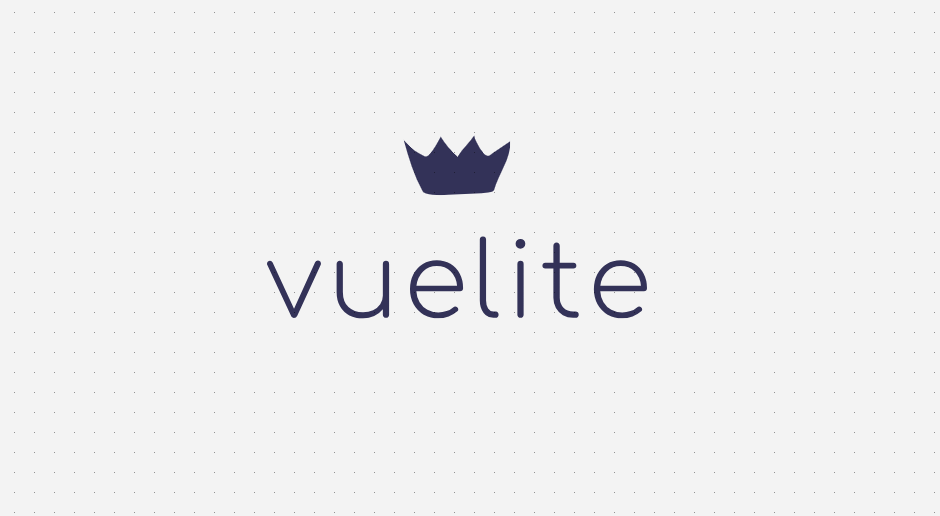
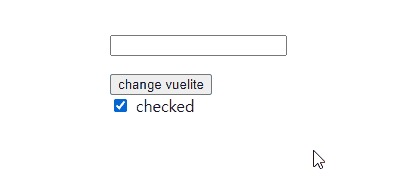
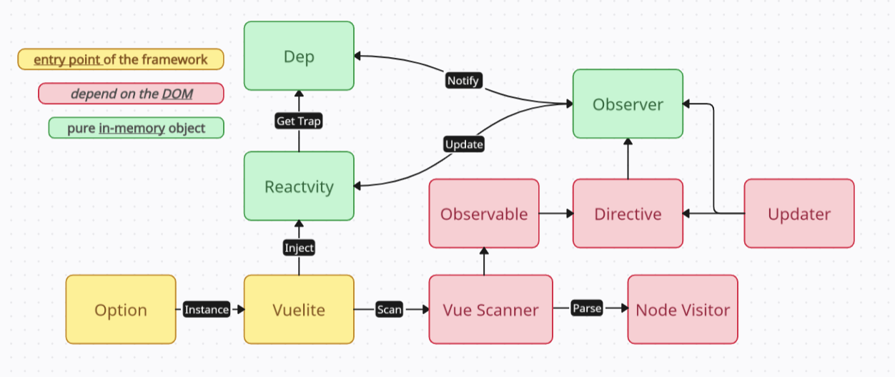
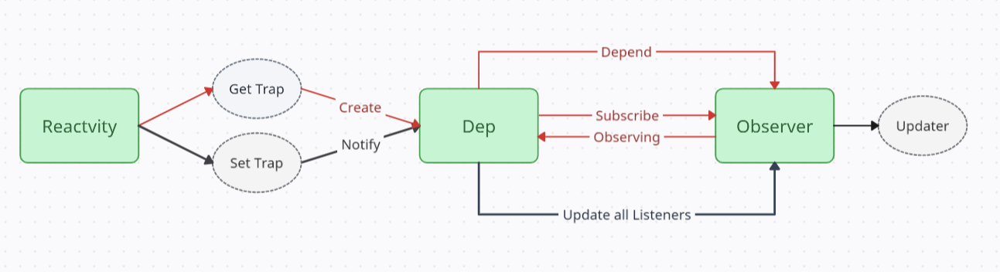
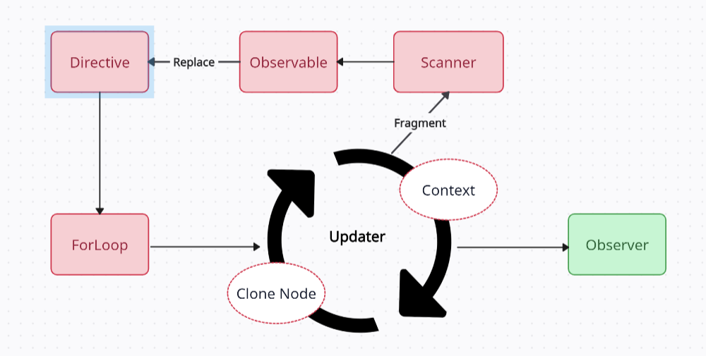
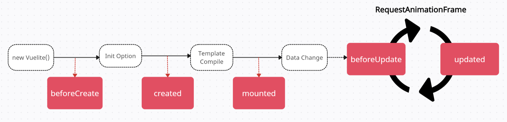
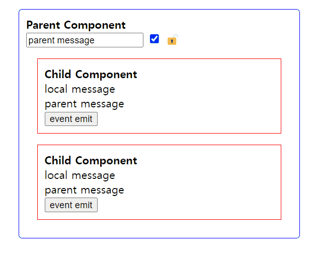

<p align='center'>
  
</p>

<p align='center'>Clones Vue.js to implement a basic MVVM framework</p>

<p align='center'>
    <a href='https://vuelite-demo.vercel.app'>
        
    </a>
    <a href=''>
        
    </a>
    <a href='https://www.npmjs.com/package/vue-lite-js'>
        
    </a>
</p>

<p align='center'>
  <strong>✅ 한국어</strong> | <a href='./README.en.md' target="_blank">English</a> 
</p>


<details>
  <summary style="font-size: 1.3em;">
    <strong>🔖 목차 (Table of contents)</strong>
  </summary>

+ **[Introduction](#-introduction)**
+ **[Changelog](#-changelog)**
+ **[Getting Started](#-getting-started)**
+ **[Basic usage](#basic-usage)**
+ **[Details](#-details)**
+ **[Overview](#-overview)**
+ **[Workflow](#-workflow)**
  + [viewmodel 생성](#1-viewmodel-생성)
  + [반응성 주입](#2-반응성-주입)
  + [디렉티브 및 템플릿 파싱](#3-디렉티브-및-템플릿-파싱)
  + [v-model 바인딩](#4-v-model-바인딩)
  + [Observer 생성](#5-observer-생성)
+ **[Extended Features](#-extended-features)**
  + [표현식 지원](#1-표현식-지원-130)
  + [조건부 렌더링](#2-조건부-렌더링-143)
  + [리스트 렌더링](#3-리스트-렌더링-155)
  + [데이터 변화에 대응하기](#4-데이터-변화에-대응하기-156)
  + [Lifecycle Hooks 추가](#5-lifecycle-hooks-추가-160)
  + [Watch 추가](#6-watch-추가-170)
  + [methods 옵션 동작방식 변경](#7-methods-옵션-동작방식-변경-171)
  + [Ref 추가, 인스턴스 속성 추가](#8-ref-추가-인스턴스-속성-추가-172)
  + [컴포넌트 단위 개발 및 props 지원](#9-컴포넌트-단위-개발-및-props-지원-200)
  + [부분적인 Composition API 스타일 지원](#10-부분적인-composition-api-스타일-지원-213)
+ **[렌더링 전략 및 문제점](#️-렌더링-전략-및-문제점-160)**
+ **[Reference](#-reference)**


</details>

## 🚀 Introduction

현대적인 프레임워크들이 `MVVM(Model-View-ViewModel)` 패턴에 기반하여 효율적인 데이터 바인딩과 사용자 인터페이스 관리를 지원하는 데서 영감을 받아, `Vue.js`의 선언적 렌더링 모델을 클론한 기초적인 `MVVM` 프레임워크입니다. 복잡한 `DOM` 조작을 추상화하여 더 간결하고 직관적인 방식으로 `UI`를 다룰 수 있게 하며, 데이터와 `UI` 상태를 자동으로 동기화하여 효율적인 사용자 인터페이스 구성을 지원합니다. 또한 템플릿 문법과 다양한 디렉티브를 통해 선언적인 `UI` 개발이 가능하며, 데이터의 변화를 즉각적으로 반영하는 `UI`를 손쉽게 구현할 수 있습니다.

주된 목표는 `Vue.js`의 핵심 동작을 클론하고 문법을 지원하면서, `MVVM` 패턴과 핵심적인 옵저버 패턴을 적용해 보는 것입니다. `Proxy` 객체를 통해 데이터의 변화를 감지하고, 해당 데이터에 의존하는 디렉티브`(Observer)`들에게 알림을 보내 화면을 업데이트 하는 방식으로 반응형 시스템을 구현합니다. 프로젝트의 전반적인 구조는 [Reference](#-reference)의 코드를 기반으로 기능들을 추가하였으며, 복잡한 문제를 충분히 고려하지 않고 최적화도 부족하지만, 양방향 데이터 바인딩과 더불어 `Vue.js`의 핵심원리를 이해하는데 도움을 줄 수 있다고 생각합니다. 


> **Note**: 여러 케이스에 대한 예시 코드를 통해 각 기능의 사용법을 확인하려면 [FEATURES.md](./docs/FEATURES.md)를 참고하세요.


## 🌟 Changelog
- ***methods, computed 내부에서 this의 타입추론 및 자동완성 개선*** `<1.1.0>`
- ***디렉티브 축약 형태 지원*** `<1.2.1>`
- ***디렉티브와 템플릿에서 표현식 지원*** `<1.3.0>`
- ***조건부 렌더링 추가 (v-if/else, v-show 디렉티브)*** `<1.4.3>`
- ***리스트 렌더링 추가 (v-for 디렉티브)*** `<1.5.5>`
- ***데이터 변화에 대응하기*** `<1.5.6>`
- ***Lifecycle Hooks 추가*** `<1.6.0>`
- ***watch 추가*** `<1.7.0>`
- ***Ref 및 인스턴스 속성 추가*** `<1.7.2>`
- ***컴포넌트 단위 개발 및 props 추가*** `<2.0.0>`
- ***부분적인 Composition API 스타일 지원*** `<2.1.3>`

## 🎉 Getting Started

- #### Using npm
`vuelite`를 `npm`에서 설치하고 프로젝트에서 사용하려면, 다음 명령어를 실행하세요
```sh
npm install vue-lite-js@latest
```

- #### Using cdn
브라우저에서 직접 사용하려면, 아래와 같이 `cdn`을 통해 스크립트를 포함하세요
```html
<script src="https://unpkg.com/vue-lite-js@latest"></script>
```

- #### Local Development
개발 환경에서 소스 코드를 수정하고 직접 테스트 하고싶으면, 다음 단계를 따라주세요

##### 저장소 클론 
```sh
git clone https://github.com/Heonys/vue-lite-js 
```
##### 의존성 설치
```sh
npm install 
```
##### 개발 서버 실행 
```sh
npm run start 
```

##### 테스트를 위한 마크다운 및 스크립트 작성  
```sh
📦 vuelite 
├── 📂 dev 
│    ├── 📄 index.html ✅
│    └── 📄 index.ts ✅
├── 📂 src ✅
│    ├── 📂 core
│    ├── 📂 types
│    ... 
```
`src`폴더 에서 소스코드를 수정하고 `dev`폴더에서 마크다운과 스크립트 작성이 가능합니다.


## 💡Basic usage

<p align="center">
  
  <br />
  <span>CDN Demo: </span>
  <a href='https://vuelite-demo.vercel.app' target="_blank">https://vuelite-demo.vercel.app</a>
</p>

```html
<div id="app">
  <input type="text" v-model="message" />
  <p v-style="textStyle">{{ message }}</p>
  <button v-on:click="handleClick">change vuelite</button>
  <div>
    <input type="checkbox" v-model="checked" />
    <span>{{ isChecked }}</span>
  </div>
</div>
```
```ts
import Vuelite from "vue-lite-js";

new Vuelite({
  el: "#app",
  data() {
    return {
      message : "",
      checked: true,
      textStyle: { color: "#FF0000" },
    }
  },
  methods: {
    handleClick() {
      this.message  = "vuelite";
    },
  },
  computed: {
    isChecked() {
      return this.checked ? "checked" : "unchecked";
    },
  }
})
```

## ✨ Details 

- `Vue.js`의 **Option API** 스타일을 클론하고 있으며, 핵심 기능을 지원하지만 모든 기능을 지원하지 않습니다. 
- 옵션에서 `template` 속성은 지원하지만, `Vue.js`의 `.vue` 확장자와 같은 로더를 지원하지 않기 때문에 `HTML` 파일에서 따로 마크업을 작성해야 하는 불편함이 있습니다. 따라서 템플릿을 분리해서 사용하는 방식은 전통적인 `Vue.js`보다는 `Angular`와 유사한 면이 있습니다.
- 싱글 파일 컴포넌트 포맷을 지원하지 않기 때문에 옵션에서 `styles`과 `scopedStyles`를 지원합니다.
- 데이터의 변화를 감지하기 위해 참조값 유지를 강제합니다. 새로운 참조값을 할당하는 대신 기존 객체의 속성을 수정함으로써, 프록시와의 연결을 유지하고, 데이터의 변화를 정확하게 추적할 수 있습니다.
- `v-if` 디렉티브는 단일 엘리먼트에서만 사용가능하며 `v-else-if` 디렉티브를 지원하지 않습니다. 
- `v-for` 디렉티브는 `key` 바인딩을 제공하지 않고 데이터 변경시 인덱스를 기준으로 항상 다시 렌더링됩니다. 
- 하나의 엘리먼트에서 `v-if`와 `v-for`를 동시에 사용하는 것을 지원하지 않습니다.
- `Lifecycle`를 간소화하여 `unmounted` 등을 제외한 주요 훅 6개를 지원합니다
- `HTML` 파일 내에서 `<template>` 태그를 사용하여 컴포넌트를 정의하고 컴포넌트 단위의 개발을 지원합니다. 


## 🧩 Overview

<p align="center">
  
</p>

## ⭐ Workflow

### 1. viewmodel 생성 
```ts
class Vuelite {
  constructor(options: Options) {
    this.el = document.querySelector(options.el);
    this.options = options;
    injectReactive(this);
    injectStyleSheet(this);
    const scanner = new VueScanner(new NodeVisitor());
    scanner.scan(this);
  }
}
```
`MVVM` 패턴에서 `viewmodel` 역할을 수행하는 `vue` 인스턴스의 생성 단계로 `option` 객체를 받아서 `DOM`과 데이터 바인딩을 제공할 수 있도록 하는 진입점 역할을 합니다.

> **Viewmodel을 구현하는 핵심 아이디어**
>1. 옵션객체로 받아온 데이터에 반응성을 불어넣어 데이터의 변화를 감지
>2. DOM을 순회하며 디렉티브를 파싱하고 옵저버를 생성  
>3. 반응형 데이터와 옵저버의 상호작용에 따른 양방향 바인딩을 달성 


### 2. 반응성 주입

<p align="center">
  
</p>


```ts
// target: 래핑하려는 원본 객체
// handler: 동작을 가로채는 메서드인 '트랩(trap)'이 담긴 객체
new Proxy(target, handler);
```
[Proxy](https://developer.mozilla.org/ko/docs/Web/JavaScript/Reference/Global_Objects/Proxy) 객체는 원본 객체를 감싸는 객체로 타겟이 되는 원본 객체에 대한 접근을 제어하거나, 특정 동작을 가로채서 새로운 기능을 추가할 수 있게 하는 래핑 객체입니다. 


`viewmodel`에서 데이터의 변화를 감지하여 실제 뷰(DOM)와의 양방향 바인딩하는 것이 우리의 목적이기 때문에 데이터의 변화에 어떻게 감지할 수 있을지 고민해 봐야 하는데 이를 위해 자바스크립트에서는 언어 차원에서 객체의 속성에 동적으로 `getter`와 `setter`를 등록할 수 있게 해주는 `Object.defineProperty`와 더불어 `Proxy`를 사용하여 이를 구현할 수 있습니다. <br /> 

>실제로 `Vue2` 에서는 `defineProperty`로 반응형 데이터를 구현하고, `Vue3` 에서는 `Proxy`를 사용하여 반응형 데이터를 구현합니다.


따라서 `Proxy`객체로 `viewmodel`의 모든 `data` 속성을 래핑하여 `get 트랩`, `set 트랩`을 추가하고 모든 속성들의 변화를 감지하도록 구현할 것입니다. <br />

```ts
const handler = {
  get(target: Target, key: string, receiver: Target) {
    // 1. get 트랩 (getter)
  },
  set(target: Target, key: string, value: any, receiver: Target) {
    // 2. set 트랩 (setter)
  },
};
new Proxy(data, handler);
```
하지만 `Proxy`를 생성하는 현재 단계에선 `getter`, `setter`를 설명하기 난해한 부분이 존재하는데 헷갈리지 말아야 하는건 이 부분은 해당 속성에 접근하거나 해당 속성의 값을 수정할 때 작동하는 트랩으로 어차피 나중에 실행되는 부분으로 핵심적인 로직이긴 하지만, 지금 단계에선 그냥 `getter`, `setter`를 등록함으로써 `Reactivty`를 주입했구나 하고 생각하면 됩니다. 

1) **get 트랩** <br />
[Dep](#dep-객체-생성) 객체를 생성하고 현재 활성화된 [Observer](#5-observer-생성)와의 의존성을 연결하는 역할을 합니다. `Scanner`에서 디렉티브를 파싱하고 `Observer`를 생성할 때, 해당 디렉티브에 해당하는 `expresion`을 `vm`에서 찾는 과정에서 `getter`를 발생시키고 따라서 해당 `expresion`에 매핑되는 `Dep`이 생성되어 생성된 `Obserber`와의 연결이 맺어집니다.

2) **set 트랩** <br />
`get 트랩`은 옵저버가 생성될 때 이미 한번은 실행되었기 때문에 이후에 `set 트랩`에서는 항상 해당하는 `key`에 대응하는 `Dep`과 매핑되어 있습니다. `setter`가 발생한 시점은 해당 속성 값의 변화가 일어났다는 뜻으로 `notify`를 호출함으로써 해당 `Dep`을 구독하고 있는 모든 `Observer`들에게 너가 의존하고 있는 속성에 변화가 일어났으니 `update`를 하라고 알림을 보내는 역할을 합니다.


#### Dep 객체 생성 
`Dep`객체는 `Dependency`의 약자로 데이터의 변화를 감지하고, 구독자인 `Observer`들에게 알림을 하는 역할을 합니다. `Proxy`를 생성할 때 데이터의 모든 속성마다 `Dep`객체가 생성되는 것으로도 알 수 있지만 모든 반응형 데이터들은 매핑되는 `Dep`을 가지고 있습니다. 여기서 `Dep` 인스턴스 자체는 매핑된 반응형 데이터에 대한 상태를 가지고 있지 않으며, 이는 `Reactivty`의 `define`메소드에서 내부적으로 `deps`라는 이름으로 `key`와 `Dep`를 매핑하여 관리하고 있기 때문에 나중에 `setter`가 동작할 때 클로저 공간에 있는 `deps`에 접근하여 매핑되는 `key`가 뭔지 알 수 있기 때문에 `Dep` 자체는 자기가 매핑된 키에 대한 상태를 갖고 있지 않고 `notify`를 할 수 있습니다.


```ts
class Dep {
  static activated: Observer
  //...
}
```
`activated`속성은 현재 활성화된 옵저버가 무엇인지 상태를 갖고 `Dep`과 `Obserber`의 의존관계를 맺기 위한 `static`변수로 일종의 전역변수 같은 느낌으로 사용됩니다. 

#### computed와 methods 주입
```ts
injectMethod(vm);
injectComputed(vm);
```
`DOM`과 바인딩이 되어야 하는 `data`들과는 다르게 `computed`와 `method`들은 반응성을 주입할 필요가 없습니다. 따라서 `viewmodel`에서 접근할 수 있도록 `viewmodel`의 속성으로 등록해 주면 되는데 핵심은 `this` 바인딩을 통해 `computed` 또는 `method`내부에서 `this`를 사용할 때 `this`가 `vm`을 가리키도록 명시적으로 지정해 줍니다.

### 3. 디렉티브 및 템플릿 파싱 
```ts
const scanner = new VueScanner(new NodeVisitor());
scanner.scan(this);
```
옵션에서 전달받은 `el` 속성으로부터 하위의 모든 노드를 순회하면서 `v-`접두사가 붙은 디렉티브 속성 또는 템플릿 문법 `{{ }}` 을 사용하고 있는 모든 텍스트를 검사합니다. 여기서 `DOM`을 순회하는게 아닌 `Node` 단위로 순회하는 이유는 템플릿을 파싱하기 위해 텍스트 노드까지 검사해야하기 때문입니다. <br />

노드 순회를 위해 순회하는 역할 자체는 `Visitor`에게 위임하고 노드마다 처리할 구체적인 액션은 `Scanner`에서 처리하도록 `Visitor`와 `Scanner`를 분리합니다.

```ts
const action = (node: Node) => {
  isReactiveNode(node) && new Observable(vm, node);
};
```
모든 노드를 순회하면서 해당 노드가 디렉티브를 갖거나 텍스트에 템플릿 문법을 가졌는지를 확인하고 `Observable` 생성합니다.  <br />

여기서 `Observable`은 단순히 `v-`접두사를 갖는 디렉티브인지 템플릿인지의 여부만 확인하여 `Directive`를 생성하고, 템플릿 바인딩은 `v-text` 디렉티브로 변경됩니다. 이때, 이벤트를 등록하는 `v-on`을 제외하고 모든 디렉티브는 디렉티브 종류에 따라서 `updater`를 인자로 받아서 `v-bind` 에서 일괄적으로 `Observer`를 생성합니다.


### 4. v-model 바인딩 

`Vue.js`의 `v-model` 디렉티브는 양방향 데이터 바인딩을 아주 간단하게 구현할 수 있게하는 디렉티브로 사용자 입력을 `vue` 인스턴스의 데이터와 자동으로 동기화합니다. 따라서 사용자의 입력을 받는 UI 요소들인 `input, textarea, select` 요소에서 사용됩니다. <br /> 

```html
<!-- v-model을 사용한 양방향 바인딩 -->
<div>
  <input type="text" v-model="title">
  <div>{{ title }}</div>
</div>`;

<!-- 단방향 바인딩 + 이벤트 핸들러 -->
<div>
  <input 
    type="text" 
    v-bind:value="title" 
    v-on:input="handleInput"
  >
  <div>{{ title }}</div>
</div>
```

실제로 `v-model`은 위의 코드처럼 `v-bind`와 `v-on:event`의 조합으로 동일하게 동작하며 `vuelite` 에서도 이러한 두가지 방식을 모두 지원합니다. 

```html
<input type="checkbox" v-model="isChecked">

<input type="radio" name="gender" value="male" v-model="selectedOption">
<input type="radio" name="gender" value="female" v-model="selectedOption">

<select v-model="selectedRadio">
  <option value="javascript">javascript</option>
  <option value="python">python</option>
</select>
```
`v-model`을 구현할 때 문제는 각각의 요소마다 바인딩되는 값이 `value`, `checked` 등으로 다를 뿐더러 같은 `checked` 속성에 바인딩 하더라도 `checkbox`와 `radio` 버튼은 동작 방식이 다르고, 이벤트도 `change`, `input` 처럼 달라지기 때문에 요소의 값이나 상태를 통일된 방식으로 접근할 수 있게해서 일관되게 바인딩하게 해줄 필요가 있습니다. <br />

따라서 `Directive` 클래스에서 `v-model`을 처리할때는 이러한 요소들 또는 타입에 따라서 일관되게 사용할 수 있게 분기처리하여 `updater`와 이벤트리스너를 등록합니다. 


### 5. Observer 생성

```ts
bind(updater?: Updater) {
  // ... 
  const value = evaluateValue(this.vm, this.exp);
  updater && updater(this.node, value);
  new Observer(this.vm, this.exp, (value) => {
    updater && updater(this.node, value);
  });
```
디렉티브 종류에 따라서 `updater`가 정해지고 결과적으로 `Obserber`가 생성됩니다. 
여기서 `updater`란 `Reactive`가 주입된 속성에서 변화가 일어나 `set 트랩`에서 `notify`가 발생했을 때 해당 `dep`을 구독하고 있는 모든 `Observer`들에게 변화가 일어났음을 알리고 업데이트를 요청하는 구체적인 업데이트 함수를 의미합니다. 즉, `Observer`는 변화에 대응하여 `DOM`을 업데이트하고 따라서 `viewmodel`의 `data` 변화가 최종적으로 화면에 반영됩니다. <br /> 

위의 코드에서 `Observer`를 생성하기 전에 `updater`를 미리 한번 실행하는데 이건 첫 렌더링에 `viewmodel`의 속성을 `DOM`에 반영하기 위함입니다. 


#### Observer와 Dep의 관계 

서로가 서로를 컬렉션으로 관리하는 다대다의 관계를 갖습니다. <br />

`Dep`의 입장에서는 여러 개의 디렉티브에서 같은 속성을 사용할 수 있기 때문에 여러 `Observer`들을 관리하고 반대로 하나의 디렉티브에서 여러 개의 반응형 데이터에 의존할 수 있기 때문에 `Observer`는 여러 `Dep`을 가질 수 있습니다.

>옵션에서 전달한 data 들은 모두 1:1로 매핑되는 Dep가 생성되고, 반대로 모든 디렉티브는 1:1로 매핑되는 Observer가 생성되어 그 둘이 상호작용 한다고 생각하면 됩니다. 


#### getterTrigger

```ts
// Observer
getterTrigger() {
  Dep.activated = this;
  const value = evaluateValue(this.vm, this.exp);
  Dep.activated = null;
  return value;
}
// Dep 
depend() {
    Dep.activated?.addDep(this);
}
```
`Observer` 클래스에는 `getterTrigger` 메소드가 존재하는데 이 메소드의 역할은 단순히 `vm`에서 해당 속성을 가져오는 일을 하고 있어 보이지만, 이 함수는 그 이상으로 중요한 역할을 하고 있습니다. 

>1. 처음에 `Reactivty` 클래스에서 모든 `data` 속성에 래핑한 프록시 객체의 `get 트랩`을 의도적으로 발생시키 위해 사용됩니다. 
>2. `get 트랩`이 발생되기 이전에 `Dep.activated`를 현재의 `this` 즉, 현재의 `Observer`로 설정을 해놓고 `get 트랩`이 발생하면 `dep.depend()`를 호출하여 현재 활성화된 `Observer`와 `Dep`의 관계를 구축합니다. 
  
결과적으로 `getterTrigger`는 반응형 데이터의 `get 트랩`을 발생시켜서 `Dep` 객체를 생성하며, 값을 가져옴과 동시에 이렇게 만들어진 `Dep`객체가 `Observer`와의 관계를 맺어주는 중요한 역할을 합니다. 즉, `Obserber`는 `Dep`을 구독하여 기다리고 `Dep`은 `Obserber`에게 감시당하다가 `Dep`이 자신의 변화가 발생했을 때 구독자`(Observer)`들에게 변화를 통지하는 관계를 형성합니다.


## ⚙️ Extended Features 

### 1. 표현식 지원 `<1.3.0>`

`Vue.js`에서 디렉티브나 템플릿 문법을 사용하다 보면 단순히 반응형 데이터를 바인딩하는게 아닌 직접 표현식을 사용해서 평가된 값을 사용하고 싶을 때가 있습니다. 

```html
<input v-bind:disabled="isDisabled ? true : false" />
<div :class="{ active: isActive }"></div>
<div v-if="count > 5"></div>
<button @click="visible = !visible"></button>

<p>{{ age + 5 }}</p> 
<p>{{ `Welcome, ${name}` }}</p> 
<p>{{ items[0] }}</p> 
```

물론, `computed` 옵션에 메소드를 정의하여 쓰는방식으로 대체가 가능하지만 재사용할 필요가 없거나 간단한 로직의 경우, 새로운 메소드를 만드는 게 번거롭고 표현식 사용이 훨씬 간단합니다. 그래서 표현식을 직접 바인딩할 수 있게 하여 더욱 유연한 템플릿 구성을 제공해야합니다. 


#### unsafeEvaluate

실제 `Vue.js`에서는 표현식을 안전하게 처리하기 위해서 별도의 파싱 및 컴파일 과정을 거칠 것으로 예상되지만, 성능과 안정성에서 약간의 타협하면서도 표현식 사용을 할 수 있도록 `Function` 생성자 함수를 사용했습니다.

```ts
function unsafeEvaluate(context: object, expression: string) {
  try {
    const fn = new Function(`
      with (this) {
        return ${expression};
      }
    `);
    return fn.call(context);
  } catch (error) {
    return undefined;
  }
}
```

또한 `methods`나 `computed` 옵션에서는 `this.title`처럼 `this`를 참조하여 반응형 데이터에 접근해야 하지만, `this`를 참조하지 않고 마치 지역 변수처럼 `title`로만 접근할 수 있도록 `new Function` 내부에서 `with` 문을 사용해 표현식의 간결성을 높였습니다.

>`with`문은 `ES5` 이후로 `deprecated`된 기능으로 권장되지 않으며, 이로 이한 성능 저하와 보안 취약점이 있을 수 있지만, `Vue.js`와 비슷한 동작 방식을 유지하기 위해 사용했습니다. 


### 2. 조건부 렌더링 `<1.4.3>`

<p align="center">
  
</p>

```html
<div>
  <input type="checkbox" v-model="visible" />
  <span>{{ visible ? "🔓" : "🔒" }}</span>

  <h1 v-if="visible">Vue is awesome!</h1>
  <h1 v-else>Oh no 😢</h1>
</div>
```
```ts
new Vuelite({
  el: "#app",
  data() {
    return {
      visible: true,
    }
  },
})
```
#### **v-if의 기본동작** <br />

`v-if` 디렉티브는 조건에 따라 `DOM` 요소를 동적으로 렌더링할지 말지를 결정하는 디렉티브입니다. 주어진 표현식이 `truthy`일 때만 해당 요소가 렌더링되며, `falsy`일 경우 요소가 `DOM`에 포함되지 않습니다. 또한 선택적으로 `v-else`를 통해 추가조건을 처리할 수 있고 `v-if`와 유사한 조건부 렌더링을 하는 `v-show`가 있습니다.


```html
<div v-if="condition">hello vue</div>
```


#### 핵심 아이디어  

1) **v-show와 v-if의 차이** <br />

`v-show` 디렉티브는 요소의 가시성을 제어하기 때문에 단순히 값에 따라서 `display: none`의 여부를 결정해 주면 되지만, `v-if`는 매핑된 데이터가 `false`일 때 `DOM`에서 사라지고 `true`가 될 때 다시 `DOM`에 삽입됩니다. 즉, `v-show`는 항상 렌더링되고 값에 따라서 스타일만 변경해 주면 되기 때문에 기존의 디렉티브 처럼 처리할 수 있고 아주 단순한 반면, `v-if`는 조건부로 요소가 삭제되거나 삽입되야하는데 여기서 삭제하는 건 어렵지 않지만, 다시 삽입될 때 어떻게 이전의 위치를 기억하고 원래 자리에 삽입할지 고민해 봐야합니다. 

2) **v-if의 기본 동작 흐름** <br />

>1. 부모 요소의 `children` 속성을 통해 현재 자식이 부모로 부터 몇 번째 인덱스 인지를 기억
>2. 조건이 `false`일 때 현재 렌더링되는 `v-if` 속성을 가진 요소를 `fragment`로 이동하여 임시보관 
>3. 조건이 `true`가 되면 부모로 부터 구한 인덱스 위치 바로 이전에 `fragment`로 부터 값을 가져와서 삽입
>4. `v-else` 디렉티브가 존재하면 `v-if`와 쌍을 이루고 이와 반대로 동작


3) **v-if의 렌더링 전략** <br />

`v-if`의 경우는 `DOM`에 직접적인 영향을 미치기 때문에 중간에 `DOM`의 구조를 변경하고 이로 인해 다른 디렉티브가 전부 파싱되기 전에 다른 디렉티브에 영향을 미칠 수 있었습니다. 그래서 `v-if` 디렉티브 처리를 미뤄놓고 모든 디렉티브를 처리한 후에 `lazy`하게 처리하도록 하였습니다.  또한 `v-if`는 기존의 `Directive`, `Observer`의 관계가 아닌 `Condition`이라는 인스턴스를 새로 생성합니다. 왜냐하면 매핑된 값이 `falsy`일때 `DOM`을 보관해야하며 `v-else` 구문에 대한 쌍을 이뤄야하기 때문에 다른 디렉티브와 다르게 추가적인 상태를 필요로 해서 분리했습니다. 

#### **v-if의 제한사항**

- `v-else-if`와 `<template v-if>`는 지원하지 않으며, `v-else`는 반드시 `v-if` 바로 뒤에 와서 쌍을 이룰 때만 정상 동작합니다. 그 외의 경우엔 `v-else` 디렉티브가 무시됩니다. 
- 중첩된 `v-if`를 제공하며, `v-if/else` 내부에서 `v-for`의 사용도 가능합니다. 하지만 `Vue.js` 공식문서에 따르면 `v-if`와 `v-for`를 같이 사용하는 것을 권장하지 않습니다. 자세한 내용은 [스타일 가이드](https://vuejs.org/style-guide/rules-essential#avoid-v-if-with-v-for)를 참고하세요
- 실제 `Vue.js`에서는 하나의 엘리먼트에서 `v-if`와 `v-for`를 같이 사용시 `v-if`가 우선순위가 더 높이 평가되어 렌더링되지만 `vuelite`에선 같이 사용할 수 없습니다.


### 3. 리스트 렌더링 `<1.5.5>`

<p align="center">
  
</p>


#### **v-for의 기본동작** <br />

`v-for` 디렉티브는 리스트 데이터를 기반으로 반복적으로 `DOM`요소를 생성 하는 디렉티브입니다. 배열, 객체, 정수값과 같은 리스트를 순회하면서 동적으로 `DOM`을 생성하고 화면에 렌더링합니다. 이 과정에서 `v-for` 디렉티브는 반복될 요소의 템플릿을 정의하며 이러한 점에서 실제로 렌더링 되지 않고 반복을 정의하는 틀을 제공하는 `HTML`의 `<template>`태그와 유사한 느낌으로 동적으로 요소를 생성하여 렌더링합니다. 
- `v-for`의 데이터는 배열, 객체, 문자열, 정수 값에 대해서 순회 가능합니다
- `v-for`의 별칭`(alias)` 값은 괄호를 사용해 인덱스와 같은 선택적 별칭을 지원합니다
```html
<div v-for="(value, key, index) in myObject"></div>
<div v-for="(item, index) in myArray"></div>
<div v-for="(value, index) in 10"></div>
```


#### 핵심 아이디어  

1) **v-if와의 공통점** <br />

기본적으로 `v-for`은 현재 위치에서 데이터의 크기만큼 순회하며 동적으로 `DOM`을 생성하는 역할을 하고 있습니다. 그렇기 때문에 `v-if`와 마찬가지로 필연적으로 `DOM`의 구조를 바꾸기 때문에 이후 파싱할 때 다른 디렉티브 처리에 영향을 줄 수 있고, 따라서 디렉티브 간의 의존성을 해결하기 위해 디렉티브 처리를 뒤로 미루고 나중에 일괄적으로 후처리를 하고 있습니다


2) **v-for의 기본 동작 흐름** <br />

>1. `v-for`로 전달받은 표현식을 분석하여 리스트의 데이터 타입과 사용된 별칭을 파악합니다. <br /> 가령 `(value, key, index) in myObject` 라는 표현식에서는 리스트 데이터가 객체이고, 별칭은 3개를 사용하고 있다는 것을 알 수 있습니다.
>3. 분석한 표현식을 기반으로 `context` 객체를 생성합니다. `context`는 리스트의 데이터 타입, `alias`의 개수에 따라서 달라지며, 각 `alias`와 현재 순회의 `index` 정보를 제공하여 이후에 `context`의 값을 사용해서 내부에서 사용된 별칭들을 계산합니다. 
>4. 리스트의 크기만큼 순회하면서, `v-for`로 정의된 엘리먼트 자체를 템플릿삼아 매 순회마다 템플릿에 `context`를 주입하여 새로운 `DOM`을 동적으로 생성합니다.
>5. 이렇게 동적으로 생성된 `DOM`은 내부에 디렉티브 또는 템플릿 문법이 있을 수 있습니다. 따라서 처음에 `Vuelite` 인스턴스를 생성하는 것과 유사하게 `scaaner`에 의해서 다시 디렉티브를 파싱하고 결과적으로 `Observer`를 만드는 절차를 반복하게 됩니다. 


3) **컨텍스트의 역할** <br />

`v-for`는 반복적으로 템플릿에 컨텍스트를 주입하여 동적으로 `DOM`을 생성한 후 스캔한다는 점에서 작은 스코프의 `Vuelite` 인스턴스처럼 동작합니다. 또한 같은 `vm`을 공유하기 때문에 `v-for` 내부에서 생성된 `DOM`의 디렉티브도 기존에 만들어진 반응형 데이터와 관계를 유지 합니다. 

`v-for`디렉티브가 결과적으로 어떻게 만들어져야할지 상상해 보면 좀더 쉽게 접근할 수 있습니다. 아래의 코드에서 `Before`의 `v-for` 디렉티브가 `After`처럼 바뀐다고 생각해 보면 `items`라는 리스트의 크기만큼 순회면서 사용된 별칭을 적절하게 바꿔주면 됩니다. 

```html
<!-- Before -->
<ul>
  <li v-for="(item, index) in items" :key="item.id">
    {{ item.message }}
  </li>
</ul>
```
```html
<!-- After -->
<ul>
  <li :key="items[0].id">{{ items[0].message }}</li>
  <li :key="items[1].id">{{ items[1].message }}</li>
  <li :key="items[2].id">{{ items[2].message }}</li>
  <!--  items 사이즈 만큼 반복 -->
</ul> 
```
하지만 이건 `items`가 배열이라고 가정할 때 `item`이 `items[index]` 형태로 바꿔준 것이고 리스트가 객체, 배열 등 타입에 따라서 어떻게 바꿔줘야 할지를 분기 처리해서 `context`를 생성해 주면 됩니다. 예를 들어 첫 번째 순회에서 컨텍스트는 아래와 같이 정의될 수 있습니다.
```js 
{ item: items[0], index: 0 } // key는 사용된 alias를 의미
```
이렇게 생성된 컨텍스트와 원본 템플릿의 복사본을 가지고 새로운 `DOM`을 생성하며, 순차적으로 만들어진 엘리먼트들을 차곡차곡 `fragment`에 저장되어 마지막으로 원래 템플릿이 있는 자리와 교체하여 화면에 렌더링합니다.

 

4) **중첩된 컨텍스트** <br /> 

만약 `v-for` 내부에서 다시 `v-for`를 사용할 경우 각 반복문의 컨텍스트가 중첩되어, 각 단계에서 적절하게 평가되어야 할 필요가 있습니다.


```html
<!-- 독립적인 배열간의 for문 중첩 -->
<div v-for="(item, index) in items">
    <div v-for="child in children">
      <div>{{ child.name }} {{ item.message }}</div>
    </div>
</div>
<!-- 중첩된 구조간의 for문 중첩 -->
<div v-for="outerItem in outer">
    <div v-for="value in outerItem.inner">
      {{ value }}
    </div>
</div>
```

디렉티브를 파싱하다가 컨텍스트가 존재하면 표현식을 평가할 때 컨텍스트를 비교해서 컨텍스트에 포함된 별칭일 경우 그 부분만 컨텍스트에서 정의한 값으로 바꿔서 평가를 해야합니다. 따라서 현재 활성화된 `Context`를 알 수 있는 방법이 필요한데 이를 위해서 `Observer`와 `Dep`의 관계를 설정하기 위해 사용한 방법이었던 `static` 변수를 생성해서 `scanner`을통해 디렉티브를 파싱하기 전에 앞뒤로 `context`를 적용하여 파싱 중에 현재 활성화된 컨텍스트를 추적할 수 있습니다. 

```js
const context = { ...parentContext, ...createContext() };

Vuelite.context = context;
const container = this.scanner.scanPartial(vm, el, loopEffects);
Vuelite.context = null;
```
이때, 부모 컨텍스트가 존재하는 중첩된 구조의 `v-for`라면 컨텍스트 또한 중첩되어 평가되어야 하기 때문에 두 개의 컨텍스트를 합쳐서 정상적으로 평가되고 있습니다. 


5) **loopEffects** <br /> 

`v-if`, `v-for` 디렉티브는 다른 디렉티브 보다 나중에 평가되야하고 `v-for`내부에서 생성되는 디렉티브도  마찬가지로 똑같은 규칙이 적용되어야 합니다. `v-for`디렉티브는 내부적으로 `ForLoop`라는 인스턴스를 만들고 `loopEffects`라는 배열을 인스턴스 변수로 갖고서 이후에 후처리 해야 할 로직들을 추가하고 스캔이 끝나면 일괄적으로 `Effects`들을 처리합니다. `deferredTasks`의 `v-for`버전 이라고 생각하면 됩니다. 


#### **v-for의 제한사항**
- `key` 바인딩 제공하지 않습니다. 내부적으로 인덱스를 사용하며 항상 다시 렌더링 됩니다.
- 중첩된 `v-for`를 제공하며, `v-for` 내부에서 `v-if`의 사용도 가능합니다. 하지만 `Vue.js` 공식문서에 따르면 `v-if`와 `v-for`를 같이 사용하는 것을 권장하지 않습니다. 자세한 내용은 [스타일 가이드](https://vuejs.org/style-guide/rules-essential#avoid-v-if-with-v-for)를 참고하세요
- 실제 `Vue.js`에서는 하나의 엘리먼트에서 `v-if`와 `v-for`를 같이 사용 시 `v-if`가 우선순위가 더 높이 평가되어 렌더링되지만 `vuelite`에선 같이 사용할 수 없습니다.


### 4. 데이터 변화에 대응하기 `<1.5.6>`

1) **반응형 데이터와 업데이트** <br />

초기에 정의한 데이터는 프록시 객체로 래핑됩니다. 그러나 템플릿에서 사용되지 않는 데이터는 옵저버가 생성되지 않으며, 이로 인해 데이터 변경 시 화면이 업데이트되지 않습니다. 즉, 데이터가 프록시로 래핑되더라도, 실제 화면 업데이트는 옵저버가 연결된 데이터에 대해서만 발생합니다. 예를 들어, 아래 코드에서 `visible`은 프록시로 감싸져서 속성의 변화가 감지되겠지만, 정작 이 데이터가 실제 `DOM`에서 사용되지 않으면, 옵저버가 없기 때문에 `visible`의 변화는 화면에 반영될 수 없습니다. 
```js
data() {
  return {
    visible: true,
  }
},
```
동적으로 생성한 속성또한 화면을 업데이트 하지않습니다. 데이터의 반응성을 보장하기 위해서는, 디렉티브 파싱 시점에서 해당 데이터가 프록시의 `get`트랩을 통과하고 이를 통해 옵저버와 데이터 간의 관계가 형성돼야 합니다. 


2) **동적 속성의 변화 감지** <br />

동적으로 생성된 속성은 화면을 업데이트하지 않지만, 옵저버와 관계가 맺어진 배열과 객체의 변화는 화면에 업데이트 되어야합니다. 가령 `v-for`에서 리스트를 순회하며 렌더링을 할때, 리스트의 개수 혹은 값이 바뀌면 화면에 업데이트가 되어야 합니다.

- **배열**: `length` 속성을 통해 변화가 감지됩니다. 단, 배열의 메소드인 `push`, `pop` 등은 길이를 변경시키지만 `sort`, `reverse`와 같은 메소드는 길이를 변경하지 않기 때문에 변화 감지가 불가능합니다.
- **객체**: 속성의 개수 변경을 감지하기 위해 커스텀 속성인 `_length`를 추가했습니다. 새로운 속성을 추가하거나 기존 속성을 삭제할 때, 이 커스텀 속성의 변경을 통해 변화에 대응합니다. 


3) **배열과 객체의 교체 감지** <br />
```js
this.items = this.items.filter(v=> v.id > 5);
this.myObject = {};
```
기존 프록시로 반응성이 주입된 객체를 새로운 객체로 교체하는 경우, 프록시와 원본 객체 간의 불일치가 발생하게 됩니다. 따라서 직접적으로 원본 객체를 교체하는 경우에는 감지가 불가능합니다. 값의 변화에만 대응할 수 있으며, 교체는 감지되지 않습니다.

이러한 이유로 `Vuelite`에서는 데이터의 변화를 감지하기 위해 **참조값 유지를 강제**합니다. 즉, 데이터의 변화를 감지하고 화면의 업데이트가 되려면 기존 객체를 직접 수정하고 참조값을 유지해야 합니다. 새로운 참조값을 할당하는 대신 기존 객체의 속성을 수정함으로써, 프록시와의 연결을 유지하고, 데이터의 변화를 정확하게 추적할 수 있습니다.


### 5. Lifecycle Hooks 추가 `<1.6.0>`

<p align="center">
  
</p>

`vuelite` 인스턴스는 생성될 때 일련의 초기화 단계를 거칩니다. 이 과정에서 데이터 반응성을 주입하고, 템플릿을 컴파일하며, `DOM`에 마운트하고, 데이터의 변경에 따라 화면을 업데이트합니다. 이러한 단계에서 특정 시점에 의도한 로직을 실행할 수 있도록 생명주기 훅을 제공합니다. `Vue.js`의 [생명주기 훅](https://vuejs.org/guide/essentials/lifecycle.html)을 간소화하여 `unmounted` 등을 제외한 주요 6개의 훅을 지원합니다.

- ***beforeCreate*** : 
`vuelite` 인스턴스 생성이 시작된 단계로 아직 모든 옵션들이 초기화되기 전 상태

- ***created*** :
모든 옵션을 전부 초기화되고, 데이터에 반응성이 주입된 단계로 이 시점부터 데이터에 접근 가능한 상태  

- ***beforeMount*** : 
인스턴스가 `DOM`에 마운트되기 직전 단계로 템플릿은 준비되었지만 아직 `DOM`에 연결되지 전 상태

- ***mounted*** :
템플릿이 파싱되어 데이터와 매핑되고, `vm`과 `DOM`이 연결되어 초기 렌더링이 완료된 상태

- ***beforeUpdate***
데이터의 변화를 감지하고 `vm`에 변경되었지만 아직 실제 `DOM`에 반영되지 않은 단계

- ***updated***
`viewmodel`의 변화가 최종적으로 실제 `DOM`에 업데이트된 직후의 단계 


#### updated 훅 주의 사항
`updated` 훅에서 반응형 데이터를 수정하면 무한 루프가 발생하기 때문에 주의해야합니다. 
이는 데이터 변경이 다시 업데이트를 트리거하여 루프가 반복되기 때문이고 이러한 동작은 실제 `Vue.js`에서도 동일합니다. 


### 6. Watch 추가 `<1.7.0>`

#### **기본동작 및 특징** 
`watch`는 데이터의 변화를 감지하고, 이에 따라 특정 로직을 실행할 수 있게 해주는 옵션입니다. 주로 데이터가 변경될 때 비동기 작업을 실행하거나 특정 데이터의 변화에 반응해 `Side Effect`를 처리할 때 사용됩니다.

```js
new Vue({
  data() {
    return {
      title: '',
    }
  },
  watch: {
    title(newVal, oldVal) {
      // .. 
    }
  }
});
```
기본적으로 `data` 옵션에서 정의된 속성의 변화를 감지하고, `watch` 옵션에 정의된 같은 이름의 메소드를 실행합니다. 또한 중첩된 객체의 경로를 사용하여 특정 속성을 감시할 수도 있으며, `computed` 속성의 변화도 감지할 수 있습니다. `watch`는 단순한 메서드 형태로 정의할 수 있으며, 객체 형태로 정의할 경우 추가적인 옵션을 사용할 수 있습니다.

```js
watch: {
    ["some.nested.key"](newVal, oldVal){
      // ... 
    },
    title: {
      handler(newValue, oldValue) { /* .. */ },
      immediate: true, 
    }
}
```

#### 핵심 아이디어  

`watch`의 핵심 동작을 보면 특정 데이터를 감시하다가 그 데이터의 변화에 대응해서 로직을 실행하는 것인데 사실 이건 `Observer`의 역할과 동일합니다. 기존에 `scanner`가 템플릿을 컴파일할 때 디렉티브를 파싱하고 그 디렉티브에 해당하는 `updater`를 반응형 데이터와 연결하듯이 `watch`도 똑같이 `Observer`를 생성하지만, 단지 `updater` 자리에 옵션에서 전달받은 `handler`를 넘겨주면됩니다.

```ts 
export function createWatchers(vm: Vuelite) {
  const { watch } = vm.options;

  Object.entries(watch).forEach(([key, value]) => {
    if (isWatchMethod(value)) { // watch가 2가지 포맷을 지원하기 때문에 분기처리  
      new Observer(vm, key, value, { immediate: false });
    } else {
      const { handler, ...options } = value;
      new Observer(vm, key, handler, options);
    }
  });
}
```

#### 제한사항 
- `Vuelite`는 참조값 유지를 강제하기 때문에, 객체에 `watch`를 설정하는 것은 의미가 없습니다. 객체를 감시하는 것은 객체 자체가 다시 할당될 때만 감지되기 때문입니다. 따라서 객체 내부의 변화를 감시하려면 `deep` 속성을 사용해야 하지만, 이는 성능적으로 비효율적이며 `Vuelite`는 `deep` 속성을 지원하지 않습니다.

- 기본적으로 `data`와 1:1 대응하여 감시하지만, `React`의 `useEffect`에서 사용되는 의존성 배열처럼 여러 데이터의 의존성을 추가하고 싶다면 `computed`를 사용하여 여러 데이터를 포함하는 메소드를 만들어야 합니다.

- `updated` 훅에서 반응형 데이터를 수정하면 안되듯 `watch`에서도 자신을 수정하면 무한 루프가 발생합니다. 


### 7. methods 옵션 동작방식 변경 `<1.7.1>`

`methods` 옵션은 이벤트 핸들러로 사용되는게 일반적이지만 `{{ getRandom() }}`과 같이 템플릿 문법에서 사용될 수도 있습니다. 하지만 이러한 경우 `methods`와 `computed`의 동작 방식에는 첫 렌더링 이후에 명확한 차이가 나게됩니다.

- **computed**: 값은 캐싱되며, 관련된 반응형 데이터가 변경될 때만 재계산됩니다.
- **methods**: 모든 렌더링 사이클에서 메서드가 호출되어 값을 다시 계산합니다.

기존의 `methods`는 `computed`와 동일하게 반응형 데이터에 의존하여 업데이트 되도록 동작했는데 라이프 사이클을 추가하면서 `updated` 단계에서 일괄적으로 모든 메소드를 다시 호출되도록 수정하였습니다. 이로인해 `methods`를 템플릿문법으로 사용시 반응형 데이터의 변경에 의존하지 않고 렌더링 사이클에서 항상 최신의 값을 갖습니다.


### 8. Ref 추가, 인스턴스 속성 추가 `<1.7.2>`

#### **Ref의 기본동작 및 특징** 
`ref`는 `DOM` 엘리먼트에 직접 접근해야 하는 경우에 사용됩니다. `this.$refs`에 의해 노출되며 주로 `DOM` 직접 접근해서 포커싱을 하거나 다른 라이브러리와의 호환성을 위해 사용됩니다. `Virtual DOM`을 사용하지않고 실제 `DOM`에 직접 연결하여 사용하는 `Vuelite`의 특성상 `ref`를 사용하는게 큰 의미가 없을 수 있습니다. 하지만 `Vue.js`를 클론하는 목적에서 완성도를 높이기 위해 추가하였습니다. 

```html
<input ref="input">
```
```js 
new Vue({
  el: "#app",
  mounted() {
    this.$refs.input.focus()
  }
});
```

#### **인스턴스 속성 추가**

```js
export interface ComponentPublicInstance {
  $data: object;
  $el: Node;
  $props: Record<string, any>;
  $parent: Vuelite | null;
  $options: Options;
  $components: ComponentMap;
  $refs: { [name: string]: Element | null };
  $watch(source: string, callback: WatchCallback, options?: WatchOption): void;
  $forceUpdate(): void;
}
```
인스턴스 속성이란 컴포넌트에서 `this`에 노출되는 빌트인 속성 및 메서드를 의미합니다. 이러한 속성들은 컴포넌트의 동작을 조절하거나 정보를 얻는 데 사용됩니다. 예를 들어, `$watch`는 동적으로 감시할 속성을 추가할 수 있게 해주며, `$forceUpdate`는 강제로 화면을 다시 렌더링할 때 사용됩니다. 이러한 인스턴스 속성들은 컴포넌트를 다루는 데 있어 편의성을 높여 주며, 내부 상태나 동작을 제어하는 데 유용합니다.


### 9. 컴포넌트 단위 개발 및 props 지원 `<2.0.0>`

<p align="center">
  
</p>

```html
<div id="app">
    <div>Parent Component</div>
    <input type="text" v-model="message">
    <input type="checkbox" v-model="visible">
    <span>{{ visible ? "🔓" : "🔒" }}</span>
    <vue-propsviewer :propsdata="message" :handlecheck="handlecheck"></vue-propsviewer>
    <vue-propsviewer :propsdata="message" :handlecheck="handlecheck"></vue-propsviewer>
</div>

<template id="propsviewer">
    <div>Child Component</div>
    <div>{{ message }}</div>
    <div>{{ propsdata }}</div>
    <button @click="handlecheck">event emit</button>
</template>
```
```ts
new Vuelite({
  el: "#app",
  data() {
    return {
      visible: true,
      message: "parent message",
    };
  },
  methods: {
    handlecheck() {
      this.visible = !this.visible;
    },
  },
  components: {
    "vue-propsviewer": {
      props: ["propsdata", "handlecheck"],
      el: "#propsviewer",
      data() {
        return {
          message: "local message",
        };
      },
    },
  },
});
```
#### 핵심 아이디어 
`DOM`과 `ViewModel`을 연결하여 양방향 바인딩을 구현하기 위해, 새로운 컴포넌트는 새로운 인스턴스를 필요로 합니다. 따라서 컴포넌트를 추가할 때는 독립적인 새로운 인스턴스를 만들어 관리해야 합니다. `Vuelite`는 싱글 파일 컴포넌트를 제공하지 않기 때문에, `HTML` 파일 내에서 `<template>` 태그를 사용하여 컴포넌트를 정의합니다. `<template>` 태그는 화면에 렌더링되지 않기 때문에, 복사하여 반복적으로 사용하면 됩니다.


**기본 동작 흐름** <br />
>1. 인스턴스 생성 전에 전역 컴포넌트를 등록할 수 있음.
>2. 인스턴스 생성 시 `components` 속성으로 로컬 컴포넌트를 등록할 수 있음.
>3. 컴포넌트는 `Record<name, options>` 형태로 이름과 해당 컴포넌트 생성에 필요한 옵션으로 매핑
>4. 템플릿 파싱중에 `<vue-component>`와 같이 하이픈이 포함된 태그를 컴포넌트로 인식.
>5. 컴포넌트가 로컬 및 전역에 등록되어 있는지 확인 (로컬 컴포넌트가 우선).
>6. 등록된 컴포넌트가 있을 경우 해당 옵션을 사용하여 새로운 인스턴스를 생성하고 기존 엘리먼트와 교체.
>7. 컴포넌트에 `props`가 있으면 교체 전에 옵저버를 생성하여 `props` 데이터의 변화가 하위 컴포넌트에 업데이트 될 수 있도록 처리.


#### 컴포넌트 종류 
-  **로컬 컴포넌트:** 
```ts
new Vuelite({
  components: {
    "vue-propsviewer": optoins,
    "login-form": optoins,
  }
});
```
인스턴스 내부에서 `components` 속성을 통해 등록된 컴포넌트로, 해당 인스턴스 내에서만 유효합니다.

- **전역 컴포넌트:** 
```ts
Vuelite.component("global-component", optoins);
```
`Vuelite.component()` 메서드를 사용하여 전역적으로 등록된 컴포넌트로, 모든 컴포넌트에서 사용 가능합니다.


#### props 및 method props

`Vue.js`의 `props`는 부모 컴포넌트가 자식 컴포넌트에 데이터를 전달하는 방법입니다. 부모 컴포넌트에서 데이터를 자식 컴포넌트로 전달할 때, `props`를 사용하여 전달하며, 자식 컴포넌트는 이러한 `props`를 통해 데이터를 받아서 처리합니다. 이때, 자식 컴포넌트는 명시적인 `props` 선언을 함으로써 외부에서 컴포넌트에 `props`를 넘길 때 어떤 속성이 처리되어야 하는지 알 수 있습니다

- **props를 통한 속성 전달**
`props`속성을통해서 부모 컴포넌트로 부터 속성을 전달 받을 수 있습니다. 이때, 부모 컴포넌트에서 `key`로 사용된 이름과 자식 컴포넌트의 `props`로 등록한 `key`의 이름과 동일해야 됩니다.

- **props를 통한 메소드 전달**
`vuejs`의 `$emit`과 같이 이벤트를 방출하는 기능은 제공하지않고 따로 부모에서 이벤트를 `props`를 통해서 내려줘야합니다.


#### 제한사항 

- 컴포넌트는 등록되는 순서가 중요해서 전역 컴포넌트는 반드시 인스턴스 생성 전에 등록되어야 합니다.
- 중첩된 컴포넌트도 마찬가지로 등록 순서가 중요합니다. 손자 컴포넌트가 가장 먼저 정의되어야 합니다.
- 커스텀 엘리먼트는 표준에 따라서 하이픈을 포함해야하고 컴포넌트도 이러한 하이픈을 포함한 태그이름으로 구분하고 있어서 반드시 하이픈을 포함한 이름으로 등록해야합니다. 
- `HTML` 속성은 대문자가 소문자로 변환되므로, 속성 이름에 주의해야 합니다. 따라서 습관적으로 속성에 `camelCase`를 사용해도 파싱되어 `props`로 전달될땐 소문자로 전달됩니다. 
- `props`는 읽기 전용이지만, `$props` 객체는 수정할 수 있어 수정하지 않고 일관성을 유지해야합니다.
- `v-slot` 기능은 지원하지 않아서 템플릿을 전달하진 못하고 단순 `props`만 제공합니다.
- 컴포넌트 중첩 사용, 동일 컴포넌트의 다중 인스턴스 사용 시 독립적으로 동작 여부, 로컬 컴포넌트 내부에서 전역 컴포넌트를 사용하는 경우와 `v-if`, `v-for` 내부에서의 컴포넌트 사용 등 다양한 케이스에서 테스트를 진행했으나, 더 복잡한 상황에서는 고려하지 못한 부분이 있을 수 있습니다.


### 10. 부분적인 Composition API 스타일 지원 `<2.1.3>`

`Vue.js`의 `Composition API` 문법들을 부분적으로 제공합니다. 두가지 `API` 스타일은 모두 동일한 시스템에 의해 동작하는 다른 인터페이스입니다. `Composition API`는 함수 범위에서 직접 반응형 데이터를 선언하는 방식으로 리액트의 함수형 컴포넌트에서 훅을 사용하는 것 과 사용성이 많이 유사하며, `Option API` 보다 확실히 자유로운 형식으로 유연한 로직을 구성할 수 있습니다.

> **Note** [Composition API 가이드](https://vuejs.org/api/composition-api-setup.html)
 
```js
import { createApp, ref, reactive, computed, watch } from "vue-lite-js";

createApp({
  setup(props) {
    const message = ref("");
    const visible = ref(true);
    const items = reactive([
      { id: 1, message: "Item 1" },
      { id: 2, message: "Item 2" },
    ]);
    const uppercaseMessage = computed(() => {
      return message.value.toUpperCase();
    });
    const addItem = () => {
      items.push({ id: 10, message: "item 10" });
    };
    const handlecheck = () => {
      visible.value = !visible.value;
    };
    watch(message, (newVal, oldVal) => {
      console.log(newVal, oldVal);
    });
    return { message, visible, items, handlecheck, addItem, uppercaseMessage };
  },
}).mount("#app");
```

#### Option API와의 호환성
실제 `Vue.js`에서는 두가지 `API` 스타일이 서로 완전히 호환되어 상황에 따라서 적절하게 섞어서 사용할 수 있도록 만들어졌습니다. 이러한 구조를 유사하게 구현하기 위해서 기존의 `Vuelite` 인스턴스가 생성되는 단계를 조금 수정하여 `mount`단계를 메소드로 나누었고 `created` 단계까지 초기화를 하고 멈춘 후 이후에 `el`, `templaet` 속성 여부에 따라서  `mount` 메소드가 즉시 동작하는 `Option API`방식, `mount`를 따로 호출해야하는 `Composition API` 방식으로 분리했습니다.


```ts
class Vuelite {
  constructor(options: Options) {
    // -> 옵션을 파싱하고 로컬 컴포넌트 생성 
    this.callHook("beforeCreate");
    // -> 데이터에 반응성을 주입하고 watch 생성 
    this.callHook("created");
    if (!this.setupDOM(options)) return this; // createApp으로 생성했다면 대기 
    this.mount(); 
  }
  mount(selector?: string){  // -> 여기서 부터 setup 함수의 진입점
    this.callHook("beforeMount");
    // ... 
  }
}
function createApp(options: CompositionAPIOptions) {
  const app = new Vuelite(options);
  const reactive = options.setup.call(app, app.$props);
  return {
    ...app,
    mount(selector: string) {
      app.mount(selector);
    },
  };
}
```

#### ref와 reactive의 차이 및 구현원리 

반응형 데이터를 선언하기 위한 방법은 2가지가 있습니다. 
- **ref:** 인자를 받아서 `.value` 속성이 있는 `ref` 객체로 래핑하여 반환
- **reactive:** 객체로 감싸는 `ref`와달리 객체자체를 `Proxy`객체로 반환

```ts
interface Ref<T> { value: T }
function ref<T>(value: T): Ref<T>
function reactive<T extends object>(target: T): T
```

일반적으로 단일 값을 갖는 원시 타입의 경우 `ref`를 사용하고, 배열이나 객체같은 참조타입의 경우 `reactive`를 사용하여 각각 반응형 데이터를 선언합니다.

`ref`를 사용하면 원시타입이 `value`라는 속성으로 접근할 수 있는 객체로 변환되는데 자바스크립트는 단일 값의 접근이나 변경에 감지할 수 있는 방법이 없기 때문에 이걸 객체로 한번 감싸서 `getter`, `setter`를 통해 객체에 대한 접근과 수정에 대해 연산을 가로채고 이로인해 값을 추적하고 데이터의 변화에 대해 렌더링을 트리거할 수 있게 됩니다. 즉, 단일 값을 객체로 래핑하면 접근할때 `.value`로 접근해야만 하기때문에 `.value` 속성은 데이터가 변경되었을 때를 감지할 기회를 주고 내부적으로 데이터를 추적하고 업데이트를 수행할 수 있습니다. 

`getter`, `setter`를 추가하기 위해 `ref`는 `Object.defineProperties`을 사용하였고 `reactive`는 `Proxy`객체의 `get`트랩, `set`트랩을 사용하였습니다. 추가적으로 이렇게 만들어진 객체를 일반객체와 구분할 수 있게 각각 `__v_isRef`, `__v_isReactive` 속성을 추가해서 식별 할 수 있게 했습니다. (이 부분은 실제 `vue.js`에서 사용중인 `flag` 참조했습니다)

```ts
// https://github.com/vuejs/core/blob/main/packages/reactivity/src/constants.ts
export enum ReactiveFlags {
  SKIP = '__v_skip',
  IS_REACTIVE = '__v_isReactive',
  IS_READONLY = '__v_isReadonly',
  IS_SHALLOW = '__v_isShallow',
  RAW = '__v_raw',
  IS_REF = '__v_isRef',
}
```

#### 지원하는 API

현재 제공된 모든 `Option API`의 기능들을 `Composition API`에서 전부 지원되지 않습니다. 

| 반응형 API    | 유틸함수      | 생명주기 훅         |
|---------------|---------------|---------------------|
| `ref()`       | `isRef()`     | `onBeforeMount()`   |
| `reactive()`  | `isProxy()`   | `onMounted()`       |
| `computed()`  |               | `onBeforeUpdate()`  |
| `watch()`     |               | `onUpdated()`       |


---

## ⚠️ 렌더링 전략 및 문제점 `<1.6.0>`

#### 1) 초기 렌더링 최적화
`vuelite`의 초기 렌더링은 꽤 최적화가 되어있어서 `DOM`을 직접 조작하는게 아닌 `fragment`를 통해서 원본 템플릿을 복사하고 메모리 상에서 디렉티브를 파싱하고 표현식을 계산합니다.
이 과정에서 디렉티브에 적합한 `updater`함수가 호출되어 메모리상의 `fragment`를 수정하고 최종적으로 `fragment`를 원래 위치에 삽입하여 효율적인 렌더링이 이루어집니다. 

#### 2) 업데이트 성능문제
초기 렌더링 이후 반응형 데이터가 변경되면, 생성된 프록시 객체의 `set` 트랩이 데이터 변경을 감지하고, `Dep`객체를 구독하는 모든 옵저버들에게 알림을 보내 결과적으로 해당 속성에 의존하는 모든 옵저버들이 업데이트 되면서 `DOM`이 업데이트됩니다.

여기서 문제는 만약 반응형 데이터가 여러 곳에서 사용될 경우 이를 구독하는 많은 옵저버들이 생성되고 데이터 변경 시 각 옵저버들이 순차적으로 업데이트 되면서 결과적으로 `DOM`에 여러 번 접근해야 하는 상황이 발생하게 됩니다. 

#### 3) 해결 전략
연속적인 `DOM`의 접근을 할 수밖에 없는 현재의 구조를 해결하기 위해서는 아래와 같은 전략이 필요합니다. 

>- 메모리상에서 `DOM`의 변경사항을 수정하고 최종적으로 원본 `DOM`에 삽입하여 효율적으로 렌더링
>- 변경사항들을 일정 시간 동안 모아놓고 일괄 처리를 통해 반복적인 `DOM` 접근을 최소화

따라서 브라우저의 렌더링 주기에 맞춰 호출되는 `requestAnimationFrame`을 통해 `updater` 함수들을 일괄 처리하면, 아무리 업데이트가 자주 일어나더라도 적어도 60프레임의 속도로 업데이트를 수행하므로, 무분별한 `DOM` 접근을 줄일 수 있습니다.

하지만 현재 `Vuelite`에선 `requestAnimationFrame`을 사용하여 프레임 단위로 `update`함수를 일괄 처리하고 있지만 변경사항을 `DOM`에 직접 접근해서 수정하기 때문에 효율적이지 못합니다.  


#### 4) 모호한 컴포넌트의 개념과 분리의 한계 

컴포넌트를 여러개로 분리할 수 있게하여 각각의 인스턴스를 독립적으로 관리하고 이를 통해 컴포넌트 단위의 개발을 지원하는 것을 목표로 기능을 추가하였다.

로컬 컴포넌트와 전역 컴포넌트를 지원함으로써 컴포넌트 분리하여 관리할 수 있다는것에 어느정도 도달하긴 했다고 생각하지만,


```js
Vuelite.component("global-component", optoins);

const vm = new Vuelite({
  el: "#app",
  components: {
    "vue-propsviewer": Options, s
  },
})
```


따라서 `defineComponent`과 같은 메소드처럼 컴포넌트 자체의 의미를 갖고 재사용하는 개념이 아니라 현재는 그냥 옵션객체가 그런 유사한 개념을 하고 결국은 내부적으로 모든처리를 메인 인스턴스에서 아루어지는 구조를 갖고있다.

하지만 그렇다고 분리라는 개념이 없는건 아니다
실제로 `<template>`태그로 마크업을 나누고 잇을뿐더러, 여러개의 인스턴스가 생성되고 template과 매핑되는건 맞다 


즉, 싱글파일 컴포넌트(SFC) 포맷을 지원하지 않는 지금의 환경에서 
템플릿 태그를 사용한 마크업의 분리는 충분히 합리적이라고 생각하고 그에 따른 옵션을 분리하여 독립적인 상태를 관리하는 것에는 도달했지만 
그게 컴포넌트 라는 개념에서의 분리가 아닌  마크업과 옵션 객체를 분리했고 결국 메인 컴포넌트에서 전부 처리하는 구조가 되었다


이러한 문제는 이전에는 크게 불편함없이 사용하다가 composition api를 도입해서 createApp을 통해 인스턴스를 생성했을때 들어났는데


메인 인스턴스를 생성해서 setup을 통해 여러가지 기능을 사용하는 것 까진 좋았지만 
다른 하위 컴포넌트를 추가하려면 반드시 `Option API`방식으로 생성해야함


-> 이상한데 


결론적으로 컴포넌트를 분리한다는 것은 옵션 객체의 정의를 분리하여 각 컴포넌트가 독립적으로 동작할 수 있게 하는 것을 의미합니다. 이것은 결국 Vue.js든 Vuelite든 상관없이 동일한 패턴입니다. 다만, Vue.js에서는 싱글 파일 컴포넌트(SFC) 포맷을 지원하여, HTML, CSS, JavaScript가 하나의 파일에 담겨 좀 더 직관적으로 관리할 수 있는 방법을 제공하는 반면, Vuelite처럼 단순한 프레임워크에서는 주로 템플릿이나 스크립트를 옵션으로 분리하는 방식을 택할 수 있습니다.


컴포넌트를 등록하는 단계에선 인스턴스가 생성되면안되고 실제로 사용되는 단계에서 인스턴스가 생성되야함
왜냐하면 컴포넌트는 독립적으로 상태를 갖고있어야하기 때문
컴포넌트를 등록하는 시점에 인스턴스를 생성하면 그 컴포넌트를 사용하는 모든 곳에서 상태를 공유하기 떄문
즉, 컴포넌트(설계도)를 등록하는 행위는 설계도를 보관한하고 실제로 컴포넌트가 사용될때 인스턴스가 생성되야함


#### 5) 한글 입력 버그🐛 
<!-- [Issue 링크 추가히기]() -->
`<input>` 또는 `<textarea>` 같은 `input` 이벤트를 발생시키는 요소에 `v-model` 디렉티브를 사용할 경우, 영어나 숫자, 특수문자에서는 문제가 없지만 한글 입력 시 양방향 바인딩이 정상적으로 동작하지 않는 버그가 있습니다. `change` 이벤트를 사용하는 `radio`, `checkbox`, `select` 등에서의 `v-model` 디렉티브는 잘 동작하는 반면, `input` 이벤트를 사용하는 경우 한글 입력 시 입력이 비정상적으로 중복되어 나타나는 현상이 발생합니다. 아마도 `IME` 입력 방식과 관련이 있는 것으로 추정되는데 해결되지 못했습니다.

##### 대체 방안 
번거롭지만 수동으로 양방향 바인딩을 구현하는 방법으로 대체할 수 있습니다.

```html 
<input type="text" v-model="title">
<!-- 아래와 같이 수동 바인딩 -->
<input type="text" :value="title" @input="handleInput">
```
```js
methods: {
  handleInput(e) {
    this.title = e.target.value;
  },
}
```

---

## 📖 Reference
- [DMQ/mvvm](https://github.com/DMQ/mvvm)
- [bowencool/bue](https://github.com/bowencool/bue)

